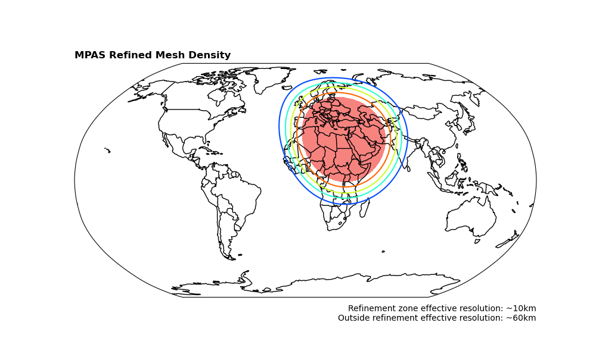
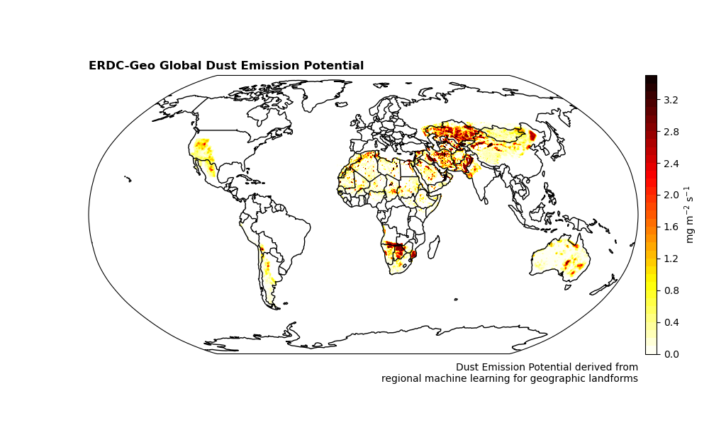

# General Information

## Navigation

*   [Dust Emission](../README.md)
*   [Dust Transport](../Transport/README.md)
*   **Information** (Current Page)

---

<table>
<tr>

</td><td width=49%>
</td>
</td>

<td width=49% style='valign:top'>
<h2>Background Information</h2>

This MPAS dust forecasting test-bed utilizes the new global ERDC-Geo scalar dataset to simulate dust-emission within the NCAR Model Prediction Across Scales (MPAS) model. For more information on MPAS see: [https://mpas-dev.github.io](https://mpas-dev.github.io). Dust emission is calculated using the AFWA-GOCART dust emission scheme ([https://gmd.copernicus.org/articles/12/131/2019/](https://gmd.copernicus.org/articles/12/131/2019/)).
</tr>
</table>

<table>
<tr>
<td width=49% style='valign:top'>
<h2>ERDC- Geo</h2>
ERDC-Geo is incorporated into the AFWA-GOCART scheme as a model correction factor to dust emission. The correction factor is determined using field measurements of dust emission to analog landforms and applying machine learning techniques to categorize landforms across the globe. In the right-image, darker orange and black colors indicate landforms that are strong dust emitters.
</td><td width=49%>
</td>
</td>
</tr>
</table>

## How to use this data

MPAS is run at least once daily during the following period of performance: **2025-08-xx** - **2025-xx-xx**. 

**Note:** It is not guaranteed that MPAS will be run every day during this time period and it is up to the forecaster to ensure the products are up-to-date. 

Two model products are provided:

1.  **Diagnostic Dust Emission:** This product shows expected 30m accumulated dust emission to show where dust emission is expected to occur and how severe it is expected to be.
2.  **Diagnostic Atmospheric Dust:** This product shows expected vertically integrated atmospheric dust. This can provide some qualitative information regarding dust transport. However, we emphasize that this product should only be used as a rough guide to understand dust transport since this variable is not part of the MPAS-GOCART suite.
    **Additionally:** Since each model cycle uses a "cold-start" dust concentration (i.e., dust = 0 everywhere), any pre-existing atmospheric dust at the time of model initialization is not represented.

## Model Information
<table><tr><td width=49% style="valign:top; border:1px solid;">
<table><tr >
<td><h3>Model Info</h3></td><td><h3>Value</h3></td></tr>

<tr><td>Mesh              </td><td> x6.999426    </td></tr>
<tr><td>Refinement Center </td><td>lon=31.3,lat=28.4 </td></tr>
<tr><td>Timestep          </td><td>60 s           </td></tr>
<tr><td>Output Frequency  </td><td>1 hour.        </td></tr>
<tr><td>Model sim time    </td><td>48 hours       </td></tr>
</table>
</td>

<td width=49% style="valign:top; border:1px solid;">
<table><tr>
<tr><td><h3>physics suite</h3>     </td><td><h3>Mesoscale reference</h3> </td></tr>

<tr><td>Microphysics      </td><td>wsm6           </td></tr>
<tr><td>Cumulus           </td><td>tiedtke        </td></tr>
<tr><td>PBL               </td><td>YSU            </td></tr>
<tr><td>GW Drag           </td><td>YSU_gwdo       </td></tr>
<tr><td>Radiation (LW/SW) </td><td>rrtmg          </td></tr>
<tr><td>Surface Layer     </td><td>MO             </td></tr>
<tr><td>Land Model        </td><td>Noah           </td></tr>
</table>
</td></tr></table>
---
## Contacts

If you have questions or issues using this test-bed please reach out to either Sandra LeGrand or Theodore Letcher:

*   Dr. Sandra LeGrand (GRL): Sandra.L.Legrand@usace.army.mil
*   Dr. Theodore Letcher (CRREL): Theodore.W.Letcher@erdc.dren.mil

