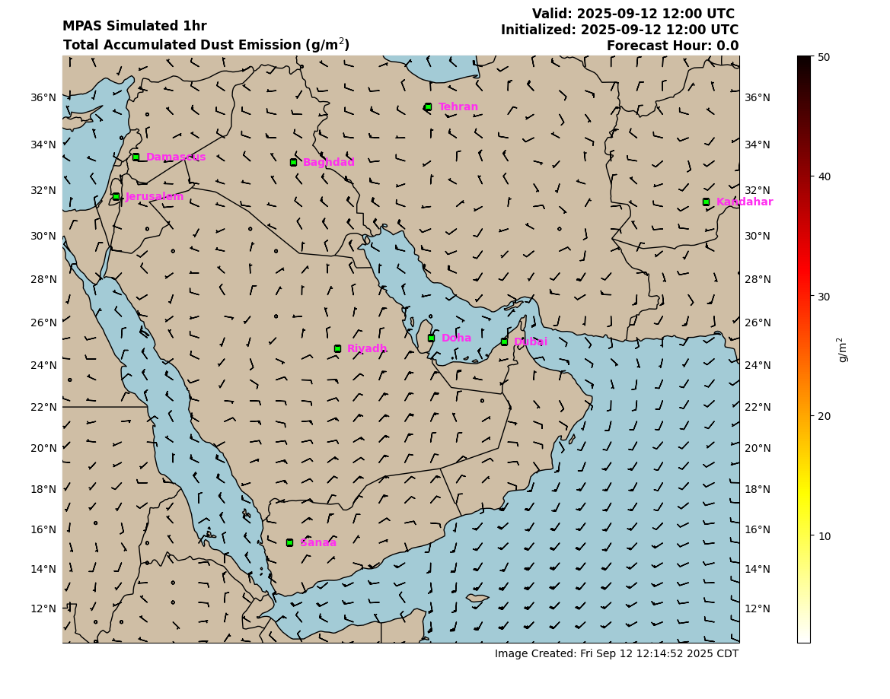
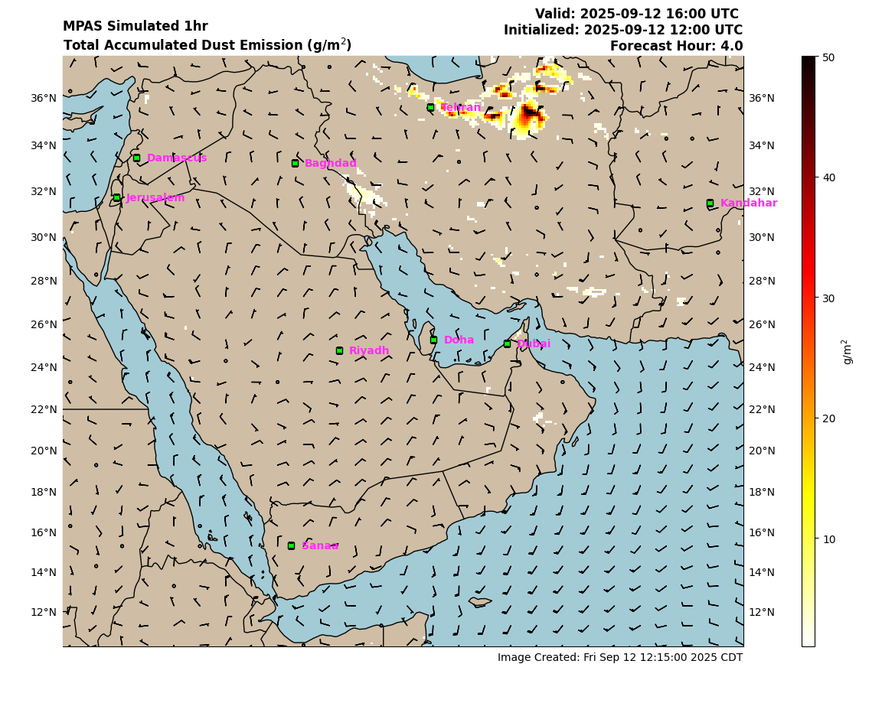
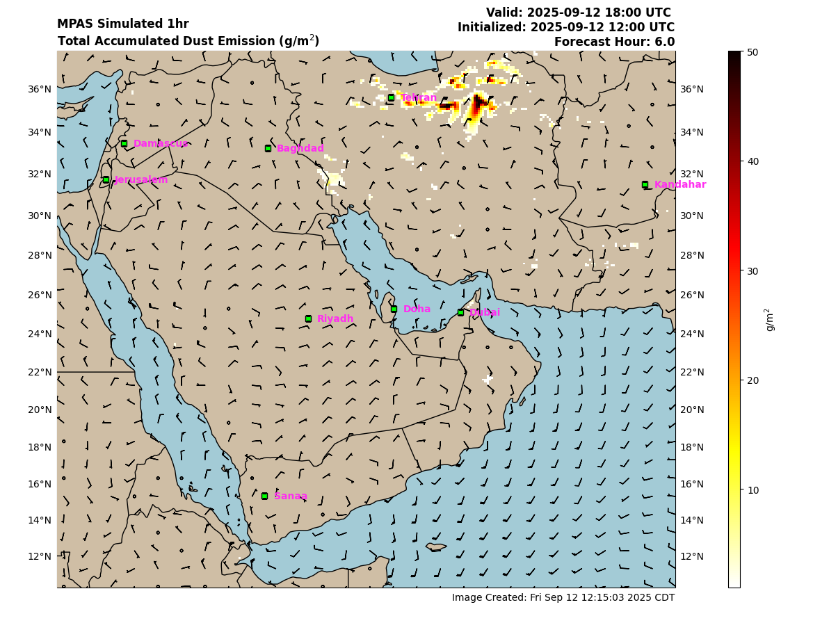
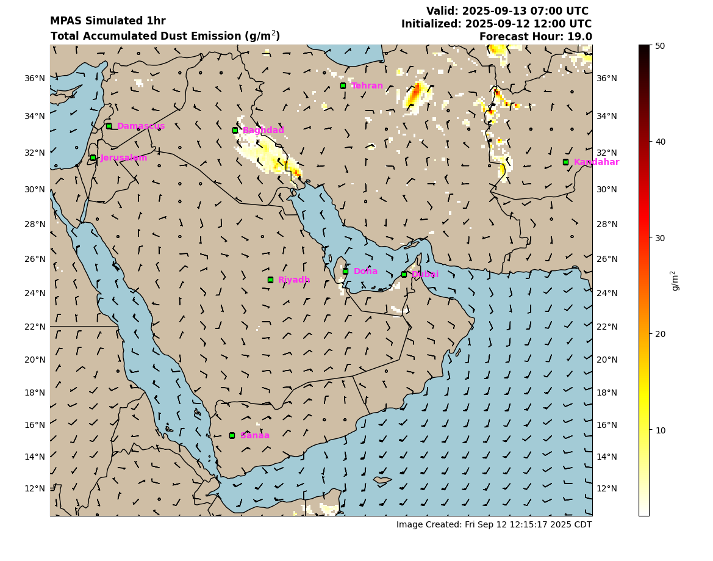
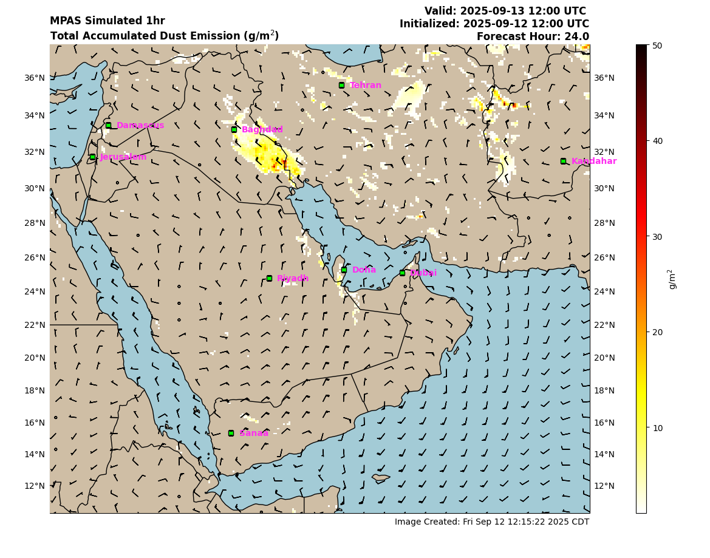
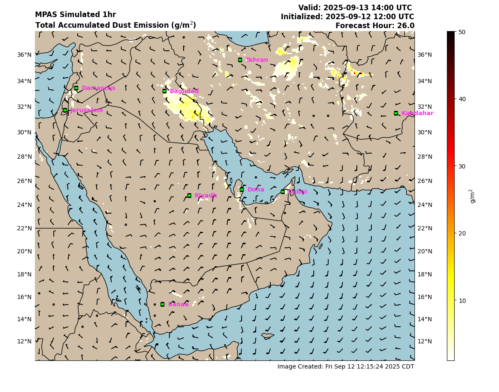
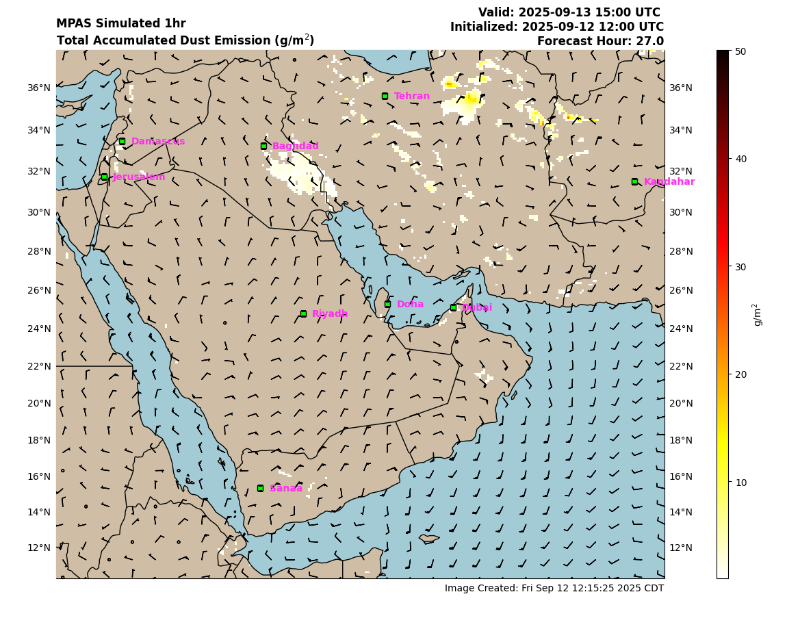
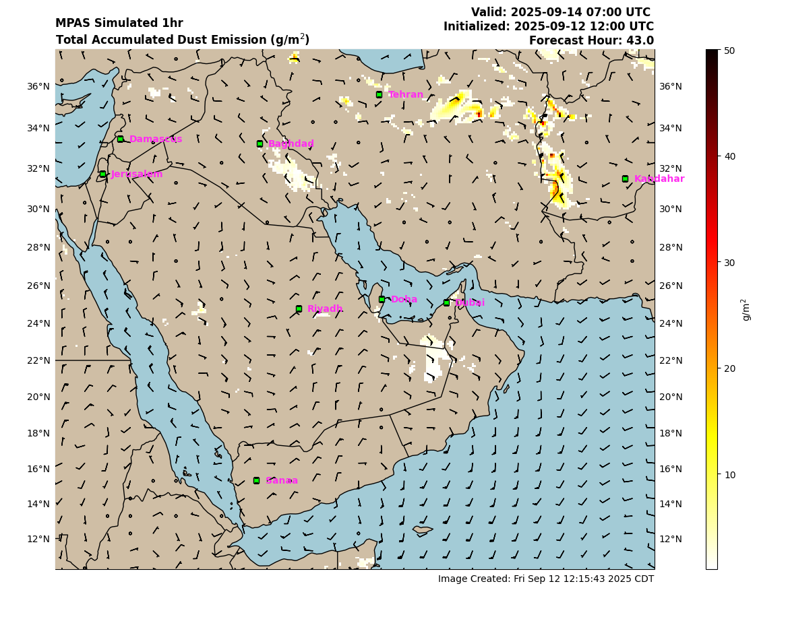
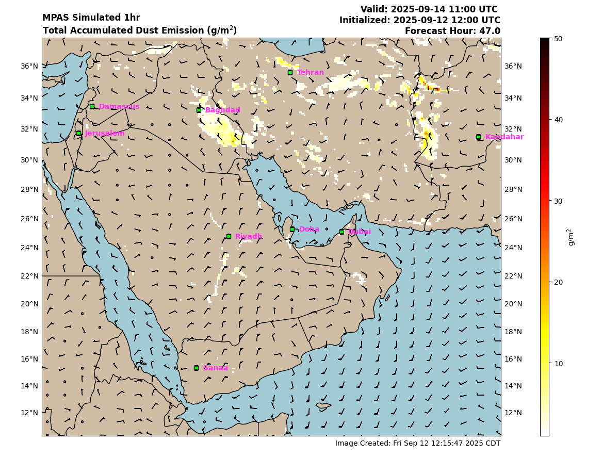

# General Information

## Navigation

*   **Dust Emission** (Current Page)
*   [Transport](Transport/README.md)
*   [Information](Information/README.md)

---

# Lastest CENTCOM Dust Emission Data 
## Most Recent Update: 20250904_06UTC
## [Home](#general-information) | [NAF](#lastest-north-africa-dust-emission-data)
### C0

<b>Forecast hour (00 - 24)</b>: 00 | [01](#c1) | [02](#c2) | [03](#c3) | [04](#c4) | [05](#c5) | [06](#c6) | [07](#c7) | [08](#c8) | [09](#c9) | [10](#c10) | [11](#c11) | [12](#c12) | [13](#c13) | [14](#c14) | [15](#c15) | [16](#c16) | [17](#c17) | [18](#c18) | [19](#c19) | [20](#c20) | [21](#c21) | [22](#c22) | [23](#c23) | [24](#c24) 
<b>Forecast hour (25 - 48)</b>: [25](#c25) | [26](#c26) | [27](#c27) | [28](#c28) | [29](#c29) | [30](#c30) | [31](#c31) | [32](#c32) | [33](#c33) | [34](#c34) | [35](#c35) | [36](#c36) | [37](#c37) | [38](#c38) | [39](#c39) | [40](#c40) | [41](#c41) | [42](#c42) | [43](#c43) | [44](#c44) | [45](#c45) | [46](#c46) | [47](#c47) | [48](#c48)

### [Top](#general-information) | [NAF](#lastest-north-africa-dust-emission-data)
### C1

<b>Forecast hour (00 - 24)</b>: [00](#c0) | 01  | [02](#c2) | [03](#c3) | [04](#c4) | [05](#c5) | [06](#c6) | [07](#c7) | [08](#c8) | [09](#c9) | [10](#c10) | [11](#c11) | [12](#c12) | [13](#c13) | [14](#c14) | [15](#c15) | [16](#c16) | [17](#c17) | [18](#c18) | [19](#c19) | [20](#c20) | [21](#c21) | [22](#c22) | [23](#c23) | [24](#c24) 
<b>Forecast hour (25 - 48)</b>: [25](#c25) | [26](#c26) | [27](#c27) | [28](#c28) | [29](#c29) | [30](#c30) | [31](#c31) | [32](#c32) | [33](#c33) | [34](#c34) | [35](#c35) | [36](#c36) | [37](#c37) | [38](#c38) | [39](#c39) | [40](#c40) | [41](#c41) | [42](#c42) | [43](#c43) | [44](#c44) | [45](#c45) | [46](#c46) | [47](#c47) | [48](#c48)

### [Top](#general-information) | [NAF](#lastest-north-africa-dust-emission-data)
### C2

<b>Forecast hour (00 - 24)</b>: [00](#c0) | [01](#c1)  | 02 | [03](#c3) | [04](#c4) | [05](#c5) | [06](#c6) | [07](#c7) | [08](#c8) | [09](#c9) | [10](#c10) | [11](#c11) | [12](#c12) | [13](#c13) | [14](#c14) | [15](#c15) | [16](#c16) | [17](#c17) | [18](#c18) | [19](#c19) | [20](#c20) | [21](#c21) | [22](#c22) | [23](#c23) | [24](#c24) 
<b>Forecast hour (25 - 48)</b>: [25](#c25) | [26](#c26) | [27](#c27) | [28](#c28) | [29](#c29) | [30](#c30) | [31](#c31) | [32](#c32) | [33](#c33) | [34](#c34) | [35](#c35) | [36](#c36) | [37](#c37) | [38](#c38) | [39](#c39) | [40](#c40) | [41](#c41) | [42](#c42) | [43](#c43) | [44](#c44) | [45](#c45) | [46](#c46) | [47](#c47) | [48](#c48)

### [Top](#general-information) | [NAF](#lastest-north-africa-dust-emission-data)
### C3 

<b>Forecast hour (00 - 24)</b>: [00](#c0) | [01](#c1) | [02](#c2) | 03 | [04](#c4) | [05](#c5) | [06](#c6) | [07](#c7) | [08](#c8) | [09](#c9) | [10](#c10) | [11](#c11) | [12](#c12) | [13](#c13) | [14](#c14) | [15](#c15) | [16](#c16) | [17](#c17) | [18](#c18) | [19](#c19) | [20](#c20) | [21](#c21) | [22](#c22) | [23](#c23) | [24](#c24) 
<b>Forecast hour (25 - 48)</b>: [25](#c25) | [26](#c26) | [27](#c27) | [28](#c28) | [29](#c29) | [30](#c30) | [31](#c31) | [32](#c32) | [33](#c33) | [34](#c34) | [35](#c35) | [36](#c36) | [37](#c37) | [38](#c38) | [39](#c39) | [40](#c40) | [41](#c41) | [42](#c42) | [43](#c43) | [44](#c44) | [45](#c45) | [46](#c46) | [47](#c47) | [48](#c48)

### [Top](#general-information) | [NAF](#lastest-north-africa-dust-emission-data)
### C4 

<b>Forecast hour (00 - 24)</b>: [00](#c0) | [01](#c1) | [02](#c2) | [03](#c3) | 04  | [05](#c5) | [06](#c6) | [07](#c7) | [08](#c8) | [09](#c9) | [10](#c10) | [11](#c11) | [12](#c12) | [13](#c13) | [14](#c14) | [15](#c15)  | [16](#c16) | [17](#c17) | [18](#c18) | [19](#c19) | [20](#c20) | [21](#c21) | [22](#c22) | [23](#c23) | [24](#c24) 
<b>Forecast hour (25 - 48)</b>: [25](#c25) | [26](#c26) | [27](#c27) | [28](#c28) | [29](#c29) | [30](#c30) | [31](#c31) | [32](#c32) | [33](#c33) | [34](#c34) | [35](#c35) | [36](#c36) | [37](#c37) | [38](#c38) | [39](#c39) | [40](#c40) | [41](#c41) | [42](#c42) | [43](#c43) | [44](#c44) | [45](#c45) | [46](#c46) | [47](#c47) | [48](#c48)

### [Top](#general-information) | [NAF](#lastest-north-africa-dust-emission-data)
### C5 

<b>Forecast hour (00 - 24)</b>: [00](#c0) | [01](#c1) | [02](#c2) | [03](#c3) | [04](#c4) | 05 | [06](#c6) | [07](#c7) | [08](#c8) | [09](#c9) | [10](#c10) | [11](#c11) | [12](#c12) | [13](#c13) | [14](#c14) | [15](#c15) | [16](#c16) | [17](#c17) | [18](#c18) | [19](#c19) | [20](#c20) | [21](#c21) | [22](#c22) | [23](#c23) | [24](#c24) 
<b>Forecast hour (25 - 48)</b>: [25](#c25) | [26](#c26) | [27](#c27) | [28](#c28) | [29](#c29) | [30](#c30) | [31](#c31) | [32](#c32) | [33](#c33) | [34](#c34) | [35](#c35) | [36](#c36) | [37](#c37) | [38](#c38) | [39](#c39) | [40](#c40) | [41](#c41) | [42](#c42) | [43](#c43) | [44](#c44) | [45](#c45) | [46](#c46) | [47](#c47) | [48](#c48)

### [Top](#general-information) | [NAF](#lastest-north-africa-dust-emission-data)
### C6 

<b>Forecast hour (00 - 24)</b>: [00](#c0) | [01](#c1) | [02](#c2) | [03](#c3) | [04](#c4)  | [05](#c5) | 06 | [07](#c7) | [08](#c8) | [09](#c9) | [10](#c10) | [11](#c11) | [12](#c12) | [13](#c13) | [14](#c14) | [15](#c15) | [16](#c16) | [17](#c17) | [18](#c18) | [19](#c19) | [20](#c20) | [21](#c21) | [22](#c22) | [23](#c23) | [24](#c24) 
<b>Forecast hour (25 - 48)</b>: [25](#c25) | [26](#c26) | [27](#c27) | [28](#c28) | [29](#c29) | [30](#c30) | [31](#c31) | [32](#c32) | [33](#c33) | [34](#c34) | [35](#c35) | [36](#c36) | [37](#c37) | [38](#c38) | [39](#c39) | [40](#c40) | [41](#c41) | [42](#c42) | [43](#c43) | [44](#c44) | [45](#c45) | [46](#c46) | [47](#c47) | [48](#c48)

### [Top](#general-information) | [NAF](#lastest-north-africa-dust-emission-data)
### C7 

<b>Forecast hour (00 - 24)</b>: [00](#c0) | [01](#c1) | [02](#c2) | [03](#c3) | [04](#c4) | [05](#c5) | [06](#c6) | 07 | [08](#c8) | [09](#c9) | [10](#c10) | [11](#c11) | [12](#c12) | [13](#c13) | [14](#c14) | [15](#c15) | [16](#c16) | [17](#c17) | [18](#c18) | [19](#c19) | [20](#c20) | [21](#c21) | [22](#c22) | [23](#c23) | [24](#c24) 
<b>Forecast hour (25 - 48)</b>: [25](#c25) | [26](#c26) | [27](#c27) | [28](#c28) | [29](#c29) | [30](#c30) | [31](#c31) | [32](#c32) | [33](#c33) | [34](#c34) | [35](#c35) | [36](#c36) | [37](#c37) | [38](#c38) | [39](#c39) | [40](#c40) | [41](#c41) | [42](#c42) | [43](#c43) | [44](#c44) | [45](#c45) | [46](#c46) | [47](#c47) | [48](#c48)

### [Top](#general-information) | [NAF](#lastest-north-africa-dust-emission-data)
### C8 

<b>Forecast hour (00 - 24)</b>: [00](#c0) | [01](#c1) | [02](#c2) | [03](#c3) | [04](#c4)  | [05](#c5) | [06](#c6) | [07](#c7) | 08 | [09](#c9) | [10](#c10) | [11](#c11) | [12](#c12) | [13](#c13) | [14](#c14) | [15](#c15) | [16](#c16) | [17](#c17) | [18](#c18) | [19](#c19) | [20](#c20) | [21](#c21) | [22](#c22) | [23](#c23) | [24](#c24) 
<b>Forecast hour (25 - 48)</b>: [25](#c25) | [26](#c26) | [27](#c27) | [28](#c28) | [29](#c29) | [30](#c30) | [31](#c31) | [32](#c32) | [33](#c33) | [34](#c34) | [35](#c35) | [36](#c36) | [37](#c37) | [38](#c38) | [39](#c39) | [40](#c40) | [41](#c41) | [42](#c42) | [43](#c43) | [44](#c44) | [45](#c45) | [46](#c46) | [47](#c47) | [48](#c48)

### [Top](#general-information) | [NAF](#lastest-north-africa-dust-emission-data)
### C9 

<b>Forecast hour (00 - 24)</b>: [00](#c0) | [01](#c1) | [02](#c2) | [03](#c3) | [04](#c4) | [05](#c5) | [06](#c6) | [07](#c7) | [08](#c8) | 09 | [10](#c10) | [11](#c11) | [12](#c12) | [13](#c13) | [14](#c14) | [15](#c15)  | [16](#c16) | [17](#c17) | [18](#c18) | [19](#c19) | [20](#c20) | [21](#c21) | [22](#c22) | [23](#c23) | [24](#c24) 
<b>Forecast hour (25 - 48)</b>: [25](#c25) | [26](#c26) | [27](#c27) | [28](#c28) | [29](#c29) | [30](#c30) | [31](#c31) | [32](#c32) | [33](#c33) | [34](#c34) | [35](#c35) | [36](#c36) | [37](#c37) | [38](#c38) | [39](#c39) | [40](#c40) | [41](#c41) | [42](#c42) | [43](#c43) | [44](#c44) | [45](#c45) | [46](#c46) | [47](#c47) | [48](#c48)

### [Top](#general-information) | [NAF](#lastest-north-africa-dust-emission-data)
### C10 

<b>Forecast hour (00 - 24)</b>: [00](#c0) | [01](#c1) | [02](#c2) | [03](#c3) | [04](#c4)  | [05](#c5) | [06](#c6) | [07](#c7) | [08](#c8) | [09](#c9) | 10 | [11](#c11) | [12](#c12) | [13](#c13) | [14](#c14) | [15](#c15)  | [16](#c16) | [17](#c17) | [18](#c18) | [19](#c19) | [20](#c20) | [21](#c21) | [22](#c22) | [23](#c23) | [24](#c24) 
<b>Forecast hour (25 - 48)</b>: [25](#c25) | [26](#c26) | [27](#c27) | [28](#c28) | [29](#c29) | [30](#c30) | [31](#c31) | [32](#c32) | [33](#c33) | [34](#c34) | [35](#c35) | [36](#c36) | [37](#c37) | [38](#c38) | [39](#c39) | [40](#c40) | [41](#c41) | [42](#c42) | [43](#c43) | [44](#c44) | [45](#c45) | [46](#c46) | [47](#c47) | [48](#c48)

### [Top](#general-information) | [NAF](#lastest-north-africa-dust-emission-data)
### C11 

<b>Forecast hour (00 - 24)</b>: [00](#c0) | [01](#c1) | [02](#c2) | [03](#c3) | [04](#c4) | [05](#c5) | [06](#c6) | [07](#c7) | [08](#c8) | [09](#c9) | [10](#c10) | 11 | [12](#c12) | [13](#c13) | [14](#c14) | [15](#c15)  | [16](#c16) | [17](#c17) | [18](#c18) | [19](#c19) | [20](#c20) | [21](#c21) | [22](#c22) | [23](#c23) | [24](#c24) 
<b>Forecast hour (25 - 48)</b>: [25](#c25) | [26](#c26) | [27](#c27) | [28](#c28) | [29](#c29) | [30](#c30) | [31](#c31) | [32](#c32) | [33](#c33) | [34](#c34) | [35](#c35) | [36](#c36) | [37](#c37) | [38](#c38) | [39](#c39) | [40](#c40) | [41](#c41) | [42](#c42) | [43](#c43) | [44](#c44) | [45](#c45) | [46](#c46) | [47](#c47) | [48](#c48)

### [Top](#general-information) | [NAF](#lastest-north-africa-dust-emission-data)
### C12 

<b>Forecast hour (00 - 24)</b>: [00](#c0) | [01](#c1) | [02](#c2) | [03](#c3) | [04](#c4)  | [05](#c5) | [06](#c6) | [07](#c7) | [08](#c8) | [09](#c9) | [10](#c10) | [11](#c11) | 12 | [13](#c13) | [14](#c14) | [15](#c15)  | [16](#c16) | [17](#c17) | [18](#c18) | [19](#c19) | [20](#c20) | [21](#c21) | [22](#c22) | [23](#c23) | [24](#c24) 
<b>Forecast hour (25 - 48)</b>: [25](#c25) | [26](#c26) | [27](#c27) | [28](#c28) | [29](#c29) | [30](#c30) | [31](#c31) | [32](#c32) | [33](#c33) | [34](#c34) | [35](#c35) | [36](#c36) | [37](#c37) | [38](#c38) | [39](#c39) | [40](#c40) | [41](#c41) | [42](#c42) | [43](#c43) | [44](#c44) | [45](#c45) | [46](#c46) | [47](#c47) | [48](#c48)

### [Top](#general-information) | [NAF](#lastest-north-africa-dust-emission-data)
### C13 

<b>Forecast hour (00 - 24)</b>: [00](#c0) | [01](#c1) | [02](#c2) | [03](#c3) | [04](#c4) | [05](#c5) | [06](#c6) | [07](#c7) | [08](#c8) | [09](#c9) | [10](#c10) | [11](#c11) | [12](#c12) | 13 | [14](#c14) | [15](#c15) | [16](#c16) | [17](#c17) | [18](#c18) | [19](#c19) | [20](#c20) | [21](#c21) | [22](#c22) | [23](#c23) | [24](#c24) 
<b>Forecast hour (25 - 48)</b>: [25](#c25) | [26](#c26) | [27](#c27) | [28](#c28) | [29](#c29) | [30](#c30) | [31](#c31) | [32](#c32) | [33](#c33) | [34](#c34) | [35](#c35) | [36](#c36) | [37](#c37) | [38](#c38) | [39](#c39) | [40](#c40) | [41](#c41) | [42](#c42) | [43](#c43) | [44](#c44) | [45](#c45) | [46](#c46) | [47](#c47) | [48](#c48)

### [Top](#general-information) | [NAF](#lastest-north-africa-dust-emission-data)
### C14 

<b>Forecast hour (00 - 24)</b>: [00](#c0) | [01](#c1) | [02](#c2) | [03](#c3) | [04](#c4)  | [05](#c5) | [06](#c6) | [07](#c7) | [08](#c8) | [09](#c9) | [10](#c10) | [11](#c11) | [12](#c12) | [13](#c13) | 14 | [15](#c15) | [16](#c16) | [17](#c17) | [18](#c18) | [19](#c19) | [20](#c20) | [21](#c21) | [22](#c22) | [23](#c23) | [24](#c24) 
<b>Forecast hour (25 - 48)</b>: [25](#c25) | [26](#c26) | [27](#c27) | [28](#c28) | [29](#c29) | [30](#c30) | [31](#c31) | [32](#c32) | [33](#c33) | [34](#c34) | [35](#c35) | [36](#c36) | [37](#c37) | [38](#c38) | [39](#c39) | [40](#c40) | [41](#c41) | [42](#c42) | [43](#c43) | [44](#c44) | [45](#c45) | [46](#c46) | [47](#c47) | [48](#c48)

### [Top](#general-information) | [NAF](#lastest-north-africa-dust-emission-data)

### C15 

<b>Forecast hour (00 - 24)</b>: [00](#c0) | [01](#c1) | [02](#c2) | [03](#c3) | [04](#c4) | [05](#c5) | [06](#c6) | [07](#c7) | [08](#c8) | [09](#c9) | [10](#c10) | [11](#c11) | [12](#c12) | [13](#c13) | [14](#c14) | 15  | [16](#c16) | [17](#c17) | [18](#c18) | [19](#c19) | [20](#c20) | [21](#c21) | [22](#c22) | [23](#c23) | [24](#c24) 
<b>Forecast hour (25 - 48)</b>: [25](#c25) | [26](#c26) | [27](#c27) | [28](#c28) | [29](#c29) | [30](#c30) | [31](#c31) | [32](#c32) | [33](#c33) | [34](#c34) | [35](#c35) | [36](#c36) | [37](#c37) | [38](#c38) | [39](#c39) | [40](#c40) | [41](#c41) | [42](#c42) | [43](#c43) | [44](#c44) | [45](#c45) | [46](#c46) | [47](#c47) | [48](#c48)

### [Top](#general-information) | [NAF](#lastest-north-africa-dust-emission-data)
### C16 

<b>Forecast hour (00 - 24)</b>: [00](#c0) | [01](#c1) | [02](#c2) | [03](#c3) | [04](#c4)  | [05](#c5) | [06](#c6) | [07](#c7) | [08](#c8) | [09](#c9) | [10](#c10) | [11](#c11) | [12](#c12) | [13](#c13) | [14](#c14) | [15](#c15)  | 16 | [17](#c17) | [18](#c18) | [19](#c19) | [20](#c20) | [21](#c21) | [22](#c22) | [23](#c23) | [24](#c24) 
<b>Forecast hour (25 - 48)</b>: [25](#c25) | [26](#c26) | [27](#c27) | [28](#c28) | [29](#c29) | [30](#c30) | [31](#c31) | [32](#c32) | [33](#c33) | [34](#c34) | [35](#c35) | [36](#c36) | [37](#c37) | [38](#c38) | [39](#c39) | [40](#c40) | [41](#c41) | [42](#c42) | [43](#c43) | [44](#c44) | [45](#c45) | [46](#c46) | [47](#c47) | [48](#c48)

### [Top](#general-information) | [NAF](#lastest-north-africa-dust-emission-data)
### C17 

<b>Forecast hour (00 - 24)</b>: [00](#c0) | [01](#c1) | [02](#c2) | [03](#c3) | [04](#c4) | [05](#c5) | [06](#c6) | [07](#c7) | [08](#c8) | [09](#c9) | [10](#c10) | [11](#c11) | [12](#c12) | [13](#c13) | [14](#c14) | [15](#c15) | [16](#c16) | 17 | [18](#c18) | [19](#c19) | [20](#c20) | [21](#c21) | [22](#c22) | [23](#c23) | [24](#c24) 
<b>Forecast hour (25 - 48)</b>: [25](#c25) | [26](#c26) | [27](#c27) | [28](#c28) | [29](#c29) | [30](#c30) | [31](#c31) | [32](#c32) | [33](#c33) | [34](#c34) | [35](#c35) | [36](#c36) | [37](#c37) | [38](#c38) | [39](#c39) | [40](#c40) | [41](#c41) | [42](#c42) | [43](#c43) | [44](#c44) | [45](#c45) | [46](#c46) | [47](#c47) | [48](#c48)

### [Top](#general-information) | [NAF](#lastest-north-africa-dust-emission-data)
### C18 

<b>Forecast hour (00 - 24)</b>: [00](#c0) | [01](#c1) | [02](#c2) | [03](#c3) | [04](#c4)  | [05](#c5) | [06](#c6) | [07](#c7) | [08](#c8) | [09](#c9) | [10](#c10) | [11](#c11) | [12](#c12) | [13](#c13) | [14](#c14) | [15](#c15) | [16](#c16) | [17](#c17) | 18 | [19](#c19) | [20](#c20) | [21](#c21) | [22](#c22) | [23](#c23) | [24](#c24) 
<b>Forecast hour (25 - 48)</b>: [25](#c25) | [26](#c26) | [27](#c27) | [28](#c28) | [29](#c29) | [30](#c30) | [31](#c31) | [32](#c32) | [33](#c33) | [34](#c34) | [35](#c35) | [36](#c36) | [37](#c37) | [38](#c38) | [39](#c39) | [40](#c40) | [41](#c41) | [42](#c42) | [43](#c43) | [44](#c44) | [45](#c45) | [46](#c46) | [47](#c47) | [48](#c48)

### [Top](#general-information) | [NAF](#lastest-north-africa-dust-emission-data)

### C19 

<b>Forecast hour (00 - 24)</b>: [00](#c0) | [01](#c1) | [02](#c2) | [03](#c3) | [04](#c4)  | [05](#c5) | [06](#c6) | [07](#c7) | [08](#c8) | [09](#c9) | [10](#c10) | [11](#c11) | [12](#c12) | [13](#c13) | [14](#c14) | [15](#c15) | [16](#c16) | [17](#c17) | [18](#c18) | 19 | [20](#c20) | [21](#c21) | [22](#c22) | [23](#c23) | [24](#c24) 
<b>Forecast hour (25 - 48)</b>: [25](#c25) | [26](#c26) | [27](#c27) | [28](#c28) | [29](#c29) | [30](#c30) | [31](#c31) | [32](#c32) | [33](#c33) | [34](#c34) | [35](#c35) | [36](#c36) | [37](#c37) | [38](#c38) | [39](#c39) | [40](#c40) | [41](#c41) | [42](#c42) | [43](#c43) | [44](#c44) | [45](#c45) | [46](#c46) | [47](#c47) | [48](#c48)

### [Top](#general-information) | [NAF](#lastest-north-africa-dust-emission-data)
### C20 

<b>Forecast hour (00 - 24)</b>: [00](#c0) | [01](#c1) | [02](#c2) | [03](#c3) | [04](#c4) | [05](#c5) | [06](#c6) | [07](#c7) | [08](#c8) | [09](#c9) | [10](#c10) | [11](#c11) | [12](#c12) | [13](#c13) | [14](#c14) | [15](#c15) | [16](#c16) | [17](#c17) | [18](#c18) | [19](#c19) | 20 | [21](#c21) | [22](#c22) | [23](#c23) | [24](#c24) 
<b>Forecast hour (25 - 48)</b>: [25](#c25) | [26](#c26) | [27](#c27) | [28](#c28) | [29](#c29) | [30](#c30) | [31](#c31) | [32](#c32) | [33](#c33) | [34](#c34) | [35](#c35) | [36](#c36) | [37](#c37) | [38](#c38) | [39](#c39) | [40](#c40) | [41](#c41) | [42](#c42) | [43](#c43) | [44](#c44) | [45](#c45) | [46](#c46) | [47](#c47) | [48](#c48)

### [Top](#general-information) | [NAF](#lastest-north-africa-dust-emission-data)
### C21

<b>Forecast hour (00 - 24)</b>: [00](#c0) | [01](#c1) | [02](#c2) | [03](#c3) | [04](#c4)  | [05](#c5) | [06](#c6) | [07](#c7) | [08](#c8) | [09](#c9) | [10](#c10) | [11](#c11) | [12](#c12) | [13](#c13) | [14](#c14) | [15](#c15) | [16](#c16) | [17](#c17) | [18](#c18) | [19](#c19) | [20](#c20) | 21 | [22](#c22) | [23](#c23) | [24](#c24) 
<b>Forecast hour (25 - 48)</b>: [25](#c25) | [26](#c26) | [27](#c27) | [28](#c28) | [29](#c29) | [30](#c30) | [31](#c31) | [32](#c32) | [33](#c33) | [34](#c34) | [35](#c35) | [36](#c36) | [37](#c37) | [38](#c38) | [39](#c39) | [40](#c40) | [41](#c41) | [42](#c42) | [43](#c43) | [44](#c44) | [45](#c45) | [46](#c46) | [47](#c47) | [48](#c48)

### [Top](#general-information) | [NAF](#lastest-north-africa-dust-emission-data)
### C22 

<b>Forecast hour (00 - 24)</b>: [00](#c0) | [01](#c1) | [02](#c2) | [03](#c3) | [04](#c4) | [05](#c5) | [06](#c6) | [07](#c7) | [08](#c8) | [09](#c9) | [10](#c10) | [11](#c11) | [12](#c12) | [13](#c13) | [14](#c14) | [15](#c15) | [16](#c16) | [17](#c17) | [18](#c18) | [19](#c19) | [20](#c20) | [21](#c21) | 22 | [23](#c23) | [24](#c24) 
<b>Forecast hour (25 - 48)</b>: [25](#c25) | [26](#c26) | [27](#c27) | [28](#c28) | [29](#c29) | [30](#c30) | [31](#c31) | [32](#c32) | [33](#c33) | [34](#c34) | [35](#c35) | [36](#c36) | [37](#c37) | [38](#c38) | [39](#c39) | [40](#c40) | [41](#c41) | [42](#c42) | [43](#c43) | [44](#c44) | [45](#c45) | [46](#c46) | [47](#c47) | [48](#c48)

### [Top](#general-information) | [NAF](#lastest-north-africa-dust-emission-data)
### C23 

<b>Forecast hour (00 - 24)</b>: [00](#c0) | [01](#c1) | [02](#c2) | [03](#c3) | [04](#c4)  | [05](#c5) | [06](#c6) | [07](#c7) | [08](#c8) | [09](#c9) | [10](#c10) | [11](#c11) | [12](#c12) | [13](#c13) | [14](#c14) | [15](#c15) | [16](#c16) | [17](#c17) | [18](#c18) | [19](#c19) | [20](#c20) | [21](#c21) | [22](#c22) | 23 | [24](#c24) 
<b>Forecast hour (25 - 48)</b>: [25](#c25) | [26](#c26) | [27](#c27) | [28](#c28) | [29](#c29) | [30](#c30) | [31](#c31) | [32](#c32) | [33](#c33) | [34](#c34) | [35](#c35) | [36](#c36) | [37](#c37) | [38](#c38) | [39](#c39) | [40](#c40) | [41](#c41) | [42](#c42) | [43](#c43) | [44](#c44) | [45](#c45) | [46](#c46) | [47](#c47) | [48](#c48)

### [Top](#general-information) | [NAF](#lastest-north-africa-dust-emission-data)
### C24 

<b>Forecast hour (00 - 24)</b>: [00](#c0) | [01](#c1) | [02](#c2) | [03](#c3) | [04](#c4) | [05](#c5) | [06](#c6) | [07](#c7) | [08](#c8) | [09](#c9) | [10](#c10) | [11](#c11) | [12](#c12) | [13](#c13) | [14](#c14) | [15](#c15) | [16](#c16) | [17](#c17) | [18](#c18) | [19](#c19) | [20](#c20) | [21](#c21) | [22](#c22) | [23](#c23) | 24  
<b>Forecast hour (25 - 48)</b>: [25](#c25) | [26](#c26) | [27](#c27) | [28](#c28) | [29](#c29) | [30](#c30) | [31](#c31) | [32](#c32) | [33](#c33) | [34](#c34) | [35](#c35) | [36](#c36) | [37](#c37) | [38](#c38) | [39](#c39) | [40](#c40) | [41](#c41) | [42](#c42) | [43](#c43) | [44](#c44) | [45](#c45) | [46](#c46) | [47](#c47) | [48](#c48)

### [Top](#general-information) | [NAF](#lastest-north-africa-dust-emission-data)
### C25

<b>Forecast hour (00 - 24)</b>: [00](#c0) | [01](#c1) | [02](#c2) | [03](#c3) | [04](#c4)  | [05](#c5) | [06](#c6) | [07](#c7) | [08](#c8) | [09](#c9) | [10](#c10) | [11](#c11) | [12](#c12) | [13](#c13) | [14](#c14) | [15](#c15) | [16](#c16) | [17](#c17) | [18](#c18) | [19](#c19) | [20](#c20) | [21](#c21) | [22](#c22) | [23](#c23) | [24](#c24) 
<b>Forecast hour (25 - 48)</b>: 25 | [26](#c26) | [27](#c27) | [28](#c28) | [29](#c29) | [30](#c30) | [31](#c31) | [32](#c32) | [33](#c33) | [34](#c34) | [35](#c35) | [36](#c36) | [37](#c37) | [38](#c38) | [39](#c39) | [40](#c40) | [41](#c41) | [42](#c42) | [43](#c43) | [44](#c44) | [45](#c45) | [46](#c46) | [47](#c47) | [48](#c48)

### [Top](#general-information) | [NAF](#lastest-north-africa-dust-emission-data)
### C26 

<b>Forecast hour (00 - 24)</b>: [00](#c0) | [01](#c1) | [02](#c2) | [03](#c3) | [04](#c4) | [05](#c5) | [06](#c6) | [07](#c7) | [08](#c8) | [09](#c9) | [10](#c10) | [11](#c11) | [12](#c12) | [13](#c13) | [14](#c14) | [15](#c15) | [16](#c16) | [17](#c17) | [18](#c18) | [19](#c19) | [20](#c20) | [21](#c21) | [22](#c22) | [23](#c23) | [24](#c24) 
<b>Forecast hour (25 - 48)</b>: [25](#c25) | 26 | [27](#c27) | [28](#c28) | [29](#c29) | [30](#c30) | [31](#c31) | [32](#c32) | [33](#c33) | [34](#c34) | [35](#c35) | [36](#c36) | [37](#c37) | [38](#c38) | [39](#c39) | [40](#c40) | [41](#c41) | [42](#c42) | [43](#c43) | [44](#c44) | [45](#c45) | [46](#c46) | [47](#c47) | [48](#c48)

### [Top](#general-information) | [NAF](#lastest-north-africa-dust-emission-data)
### C27 

<b>Forecast hour (00 - 24)</b>: [00](#c0) | [01](#c1) | [02](#c2) | [03](#c3) | [04](#c4)  | [05](#c5) | [06](#c6) | [07](#c7) | [08](#c8) | [09](#c9) | [10](#c10) | [11](#c11) | [12](#c12) | [13](#c13) | [14](#c14) | [15](#c15) | [16](#c16) | [17](#c17) | [18](#c18) | [19](#c19) | [20](#c20) | [21](#c21) | [22](#c22) | [23](#c23) | [24](#c24) 
<b>Forecast hour (25 - 48)</b>: [25](#c25) | [26](#c26) | 27 | [28](#c28) | [29](#c29) | [30](#c30) | [31](#c31) | [32](#c32) | [33](#c33) | [34](#c34) | [35](#c35) | [36](#c36) | [37](#c37) | [38](#c38) | [39](#c39) | [40](#c40) | [41](#c41) | [42](#c42) | [43](#c43) | [44](#c44) | [45](#c45) | [46](#c46) | [47](#c47) | [48](#c48)

### [Top](#general-information) | [NAF](#lastest-north-africa-dust-emission-data)
### C28 

<b>Forecast hour (00 - 24)</b>: [00](#c0) | [01](#c1) | [02](#c2) | [03](#c3) | [04](#c4) | [05](#c5) | [06](#c6) | [07](#c7) | [08](#c8) | [09](#c9) | [10](#c10) | [11](#c11) | [12](#c12) | [13](#c13) | [14](#c14) | [15](#c15) | [16](#c16) | [17](#c17) | [18](#c18) | [19](#c19) | [20](#c20) | [21](#c21) | [22](#c22) | [23](#c23) | [24](#c24) 
<b>Forecast hour (25 - 48)</b>: [25](#c25) | [26](#c26) | [27](#c27) | 28 | [29](#c29) | [30](#c30) | [31](#c31) | [32](#c32) | [33](#c33) | [34](#c34) | [35](#c35) | [36](#c36) | [37](#c37) | [38](#c38) | [39](#c39) | [40](#c40) | [41](#c41) | [42](#c42) | [43](#c43) | [44](#c44) | [45](#c45) | [46](#c46) | [47](#c47) | [48](#c48)

### [Top](#general-information) | [NAF](#lastest-north-africa-dust-emission-data)
### C29

<b>Forecast hour (00 - 24)</b>: [00](#c0) | [01](#c1) | [02](#c2) | [03](#c3) | [04](#c4)  | [05](#c5) | [06](#c6) | [07](#c7) | [08](#c8) | [09](#c9) | [10](#c10) | [11](#c11) | [12](#c12) | [13](#c13) | [14](#c14) | [15](#c15) | [16](#c16) | [17](#c17) | [18](#c18) | [19](#c19) | [20](#c20) | [21](#c21) | [22](#c22) | [23](#c23) | [24](#c24) 
<b>Forecast hour (25 - 48)</b>: [25](#c25) | [26](#c26) | [27](#c27) | [28](#c28) | 29 | [30](#c30) | [31](#c31) | [32](#c32) | [33](#c33) | [34](#c34) | [35](#c35) | [36](#c36) | [37](#c37) | [38](#c38) | [39](#c39) | [40](#c40) | [41](#c41) | [42](#c42) | [43](#c43) | [44](#c44) | [45](#c45) | [46](#c46) | [47](#c47) | [48](#c48)

### [Top](#general-information) | [NAF](#lastest-north-africa-dust-emission-data)
### C30 

<b>Forecast hour (00 - 24)</b>: [00](#c0) | [01](#c1) | [02](#c2) | [03](#c3) | [04](#c4) | [05](#c5) | [06](#c6) | [07](#c7) | [08](#c8) | [09](#c9) | [10](#c10) | [11](#c11) | [12](#c12) | [13](#c13) | [14](#c14) | [15](#c15) | [16](#c16) | [17](#c17) | [18](#c18) | [19](#c19) | [20](#c20) | [21](#c21) | [22](#c22) | [23](#c23) | [24](#c24) 
<b>Forecast hour (25 - 48)</b>: [25](#c25) | [26](#c26) | [27](#c27) | [28](#c28) | [29](#c29) | 30 | [31](#c31) | [32](#c32) | [33](#c33) | [34](#c34) | [35](#c35) | [36](#c36) | [37](#c37) | [38](#c38) | [39](#c39) | [40](#c40) | [41](#c41) | [42](#c42) | [43](#c43) | [44](#c44) | [45](#c45) | [46](#c46) | [47](#c47) | [48](#c48)

### [Top](#general-information) | [NAF](#lastest-north-africa-dust-emission-data)
### C31 

<b>Forecast hour (00 - 24)</b>: [00](#c0) | [01](#c1) | [02](#c2) | [03](#c3) | [04](#c4)  | [05](#c5) | [06](#c6) | [07](#c7) | [08](#c8) | [09](#c9) | [10](#c10) | [11](#c11) | [12](#c12) | [13](#c13) | [14](#c14) | [15](#c15) | [16](#c16) | [17](#c17) | [18](#c18) | [19](#c19) | [20](#c20) | [21](#c21) | [22](#c22) |[23](#c23) | [24](#c24) 
<b>Forecast hour (25 - 48)</b>: [25](#c25) | [26](#c26) | [27](#c27) | [28](#c28) | [29](#c29) | [30](#c30) | 31 | [32](#c32) | [33](#c33) | [34](#c34) | [35](#c35) | [36](#c36) | [37](#c37) | [38](#c38) | [39](#c39) | [40](#c40) | [41](#c41) | [42](#c42) | [43](#c43) | [44](#c44) | [45](#c45) | [46](#c46) | [47](#c47) | [48](#c48)

### [Top](#general-information) | [NAF](#lastest-north-africa-dust-emission-data)
### C32 

<b>Forecast hour (00 - 24)</b>: [00](#c0) | [01](#c1) | [02](#c2) | [03](#c3) | [04](#c4) | [05](#c5) | [06](#c6) | [07](#c7) | [08](#c8) | [09](#c9) | [10](#c10) | [11](#c11) | [12](#c12) | [13](#c13) | [14](#c14) | [15](#c15) | [16](#c16) | [17](#c17) | [18](#c18) | [19](#c19) | [20](#c20) | [21](#c21) | [22](#c22) | [23](#c23) | [24](#c24)  
<b>Forecast hour (25 - 48)</b>: [25](#c25) | [26](#c26) | [27](#c27) | [28](#c28) | [29](#c29) | [30](#c30) | [31](#c31) | 32 | [33](#c33) | [34](#c34) | [35](#c35) | [36](#c36) | [37](#c37) | [38](#c38) | [39](#c39) | [40](#c40) | [41](#c41) | [42](#c42) | [43](#c43) | [44](#c44) | [45](#c45) | [46](#c46) | [47](#c47) | [48](#c48)

### [Top](#general-information) | [NAF](#lastest-north-africa-dust-emission-data)
### C33

<b>Forecast hour (00 - 24)</b>: [00](#c0) | [01](#c1) | [02](#c2) | [03](#c3) | [04](#c4)  | [05](#c5) | [06](#c6) | [07](#c7) | [08](#c8) | [09](#c9) | [10](#c10) | [11](#c11) | [12](#c12) | [13](#c13) | [14](#c14) | [15](#c15) | [16](#c16) | [17](#c17) | [18](#c18) | [19](#c19) | [20](#c20) | [21](#c21) | [22](#c22) | [23](#c23) | [24](#c24) 
<b>Forecast hour (25 - 48)</b>:  [25](#c25) | [26](#c26) | [27](#c27) | [28](#c28) | [29](#c29) | [30](#c30) | [31](#c31) | [32](#c32) | 33 | [34](#c34) | [35](#c35) | [36](#c36) | [37](#c37) | [38](#c38) | [39](#c39) | [40](#c40) | [41](#c41) | [42](#c42) | [43](#c43) | [44](#c44) | [45](#c45) | [46](#c46) | [47](#c47) | [48](#c48)

### [Top](#general-information) | [NAF](#lastest-north-africa-dust-emission-data)
### C34 

<b>Forecast hour (00 - 24)</b>: [00](#c0) | [01](#c1) | [02](#c2) | [03](#c3) | [04](#c4) | [05](#c5) | [06](#c6) | [07](#c7) | [08](#c8) | [09](#c9) | [10](#c10) | [11](#c11) | [12](#c12) | [13](#c13) | [14](#c14) | [15](#c15) | [16](#c16) | [17](#c17) | [18](#c18) | [19](#c19) | [20](#c20) | [21](#c21) | [22](#c22) | [23](#c23) | [24](#c24) 
<b>Forecast hour (25 - 48)</b>: [25](#c25) | [26](#c26) | [27](#c27) | [28](#c28) | [29](#c29) | [30](#c30) | [31](#c31) | [32](#c32) | [33](#c33) | 34 | [35](#c35) | [36](#c36) | [37](#c37) | [38](#c38) | [39](#c39) | [40](#c40) | [41](#c41) | [42](#c42) | [43](#c43) | [44](#c44) | [45](#c45) | [46](#c46) | [47](#c47) | [48](#c48)

### [Top](#general-information) | [NAF](#lastest-north-africa-dust-emission-data)
### C35 

<b>Forecast hour (00 - 24)</b>: [00](#c0) | [01](#c1) | [02](#c2) | [03](#c3) | [04](#c4)  | [05](#c5) | [06](#c6) | [07](#c7) | [08](#c8) | [09](#c9) | [10](#c10) | [11](#c11) | [12](#c12) | [13](#c13) | [14](#c14) | [15](#c15) | [16](#c16) | [17](#c17) | [18](#c18) | [19](#c19) | [20](#c20) | [21](#c21) | [22](#c22) | [23](#c23) | [24](#c24) 
<b>Forecast hour (25 - 48)</b>: [25](#c25) | [26](#c26) | [27](#c27) | [28](#c28) | [29](#c29) | [30](#c30) | [31](#c31) | [32](#c32) | [33](#c33) | [34](#c34) | 35 | [36](#c36) | [37](#c37) | [38](#c38) | [39](#c39) | [40](#c40) | [41](#c41) | [42](#c42) | [43](#c43) | [44](#c44) | [45](#c45) | [46](#c46) | [47](#c47) | [48](#c48)

### [Top](#general-information) | [NAF](#lastest-north-africa-dust-emission-data)
### C36 

<b>Forecast hour (00 - 24)</b>: [00](#c0) | [01](#c1) | [02](#c2) | [03](#c3) | [04](#c4) | [05](#c5) | [06](#c6) | [07](#c7) | [08](#c8) | [09](#c9) | [10](#c10) | [11](#c11) | [12](#c12) | [13](#c13) | [14](#c14) | [15](#c15) | [16](#c16) | [17](#c17) | [18](#c18) | [19](#c19) | [20](#c20) | [21](#c21) | [22](#c22) | [23](#c23) | [24](#c24) 
<b>Forecast hour (25 - 48)</b>: [25](#c25) | [26](#c26) | [27](#c27) | [28](#c28) | [29](#c29) | [30](#c30) | [31](#c31) | [32](#c32) | [33](#c33) | [34](#c34) | [35](#c35) | 36 | [37](#c37) | [38](#c38) | [39](#c39) | [40](#c40) | [41](#c41) | [42](#c42) | [43](#c43) | [44](#c44) | [45](#c45) | [46](#c46) | [47](#c47) | [48](#c48)

### [Top](#general-information) | [NAF](#lastest-north-africa-dust-emission-data)
### C37

<b>Forecast hour (00 - 24)</b>: [00](#c0) | [01](#c1) | [02](#c2) | [03](#c3) | [04](#c4)  | [05](#c5) | [06](#c6) | [07](#c7) | [08](#c8) | [09](#c9) | [10](#c10) | [11](#c11) | [12](#c12) | [13](#c13) | [14](#c14) | [15](#c15) | [16](#c16) | [17](#c17) | [18](#c18) | [19](#c19) | [20](#c20) | [21](#c21) | [22](#c22) | [23](#c23) | [24](#c24) 
<b>Forecast hour (25 - 48)</b>: [25](#c25) | [26](#c26) | [27](#c27) | [28](#c28) | [29](#c29) | [30](#c30) | [31](#c31) | [32](#c32) | [33](#c33) | [34](#c34) | [35](#c35) | [36](#c36) | 37 | [38](#c38) | [39](#c39) | [40](#c40) | [41](#c41) | [42](#c42) | [43](#c43) | [44](#c44) | [45](#c45) | [46](#c46) | [47](#c47) | [48](#c48)

### [Top](#general-information) | [NAF](#lastest-north-africa-dust-emission-data)
### C38 

<b>Forecast hour (00 - 24)</b>: [00](#c0) | [01](#c1) | [02](#c2) | [03](#c3) | [04](#c4) | [05](#c5) | [06](#c6) | [07](#c7) | [08](#c8) | [09](#c9) | [10](#c10) | [11](#c11) | [12](#c12) | [13](#c13) | [14](#c14) | [15](#c15) | [16](#c16) | [17](#c17) | [18](#c18) | [19](#c19) | [20](#c20) | [21](#c21) | [22](#c22) | [23](#c23) | [24](#c24) 
<b>Forecast hour (25 - 48)</b>: [25](#c25) | [26](#c26) | [27](#c27) | [28](#c28) | [29](#c29) | [30](#c30) | [31](#c31) | [32](#c32) | [33](#c33) | [34](#c34) | [35](#c35) | [36](#c36) | [37](#c37) | 38 | [39](#c39) | [40](#c40) | [41](#c41) | [42](#c42) | [43](#c43) | [44](#c44) | [45](#c45) | [46](#c46) | [47](#c47) | [48](#c48)

### [Top](#general-information) | [NAF](#lastest-north-africa-dust-emission-data)
### C39 

<b>Forecast hour (00 - 24)</b>: [00](#c0) | [01](#c1) | [02](#c2) | [03](#c3) | [04](#c4)  | [05](#c5) | [06](#c6) | [07](#c7) | [08](#c8) | [09](#c9) | [10](#c10) | [11](#c11) | [12](#c12) | [13](#c13) | [14](#c14) | [15](#c15) | [16](#c16) | [17](#c17) | [18](#c18) | [19](#c19) | [20](#c20) | [21](#c21) | [22](#c22) |[23](#c23) | [24](#c24) 
<b>Forecast hour (25 - 48)</b>: [25](#c25) | [26](#c26) | [27](#c27) | [28](#c28) | [29](#c29) | [30](#c30) | [31](#c31) | [32](#c32) | [33](#c33) | [34](#c34) | [35](#c35) | [36](#c36) | [37](#c37) | [38](#c38) | 39 | [40](#c40) | [41](#c41) | [42](#c42) | [43](#c43) | [44](#c44) | [45](#c45) | [46](#c46) | [47](#c47) | [48](#c48)

### [Top](#general-information) | [NAF](#lastest-north-africa-dust-emission-data)
### C40 

<b>Forecast hour (00 - 24)</b>: [00](#c0) | [01](#c1) | [02](#c2) | [03](#c3) | [04](#c4) | [05](#c5) | [06](#c6) | [07](#c7) | [08](#c8) | [09](#c9) | [10](#c10) | [11](#c11) | [12](#c12) | [13](#c13) | [14](#c14) | [15](#c15) | [16](#c16) | [17](#c17) | [18](#c18) | [19](#c19) | [20](#c20) | [21](#c21) | [22](#c22) | [23](#c23) | [24](#c24)  
<b>Forecast hour (25 - 48)</b>: [25](#c25) | [26](#c26) | [27](#c27) | [28](#c28) | [29](#c29) | [30](#c30) | [31](#c31) | [32](#c32) | [33](#c33) | [34](#c34) | [35](#c35) | [36](#c36) | [37](#c37) | [38](#c38) | [39](#c39) | 40 | [41](#c41) | [42](#c42) | [43](#c43) | [44](#c44) | [45](#c45) | [46](#c46) | [47](#c47) | [48](#c48)

### [Top](#general-information) | [NAF](#lastest-north-africa-dust-emission-data)
### C41

<b>Forecast hour (00 - 24)</b>: [00](#c0) | [01](#c1) | [02](#c2) | [03](#c3) | [04](#c4)  | [05](#c5) | [06](#c6) | [07](#c7) | [08](#c8) | [09](#c9) | [10](#c10) | [11](#c11) | [12](#c12) | [13](#c13) | [14](#c14) | [15](#c15) | [16](#c16) | [17](#c17) | [18](#c18) | [19](#c19) | [20](#c20) | [21](#c21) | [22](#c22) | [23](#c23) | [24](#c24) 
<b>Forecast hour (25 - 48)</b>:  [25](#c25) | [26](#c26) | [27](#c27) | [28](#c28) | [29](#c29) | [30](#c30) | [31](#c31) | [32](#c32) | [33](#c33) | [34](#c34) | [35](#c35) | [36](#c36) | [37](#c37) | [38](#c38) | [39](#c39) | [40](#c40) | 41 | [42](#c42) | [43](#c43) | [44](#c44) | [45](#c45) | [46](#c46) | [47](#c47) | [48](#c48)

### [Top](#general-information) | [NAF](#lastest-north-africa-dust-emission-data)
### C42 

<b>Forecast hour (00 - 24)</b>: [00](#c0) | [01](#c1) | [02](#c2) | [03](#c3) | [04](#c4) | [05](#c5) | [06](#c6) | [07](#c7) | [08](#c8) | [09](#c9) | [10](#c10) | [11](#c11) | [12](#c12) | [13](#c13) | [14](#c14) | [15](#c15) | [16](#c16) | [17](#c17) | [18](#c18) | [19](#c19) | [20](#c20) | [21](#c21) | [22](#c22) | [23](#c23) | [24](#c24) 
<b>Forecast hour (25 - 48)</b>: [25](#c25) | [26](#c26) | [27](#c27) | [28](#c28) | [29](#c29) | [30](#c30) | [31](#c31) | [32](#c32) | [33](#c33) | [34](#c34) | [35](#c35) | [36](#c36) | [37](#c37) | [38](#c38) | [39](#c39) | [40](#c40) | [41](#c41) | 42 | [43](#c43) | [44](#c44) | [45](#c45) | [46](#c46) | [47](#c47) | [48](#c48)

### [Top](#general-information) | [NAF](#lastest-north-africa-dust-emission-data)
### C43 

<b>Forecast hour (00 - 24)</b>: [00](#c0) | [01](#c1) | [02](#c2) | [03](#c3) | [04](#c4)  | [05](#c5) | [06](#c6) | [07](#c7) | [08](#c8) | [09](#c9) | [10](#c10) | [11](#c11) | [12](#c12) | [13](#c13) | [14](#c14) | [15](#c15) | [16](#c16) | [17](#c17) | [18](#c18) | [19](#c19) | [20](#c20) | [21](#c21) | [22](#c22) | [23](#c23) | [24](#c24) 
<b>Forecast hour (25 - 48)</b>: [25](#c25) | [26](#c26) | [27](#c27) | [28](#c28) | [29](#c29) | [30](#c30) | [31](#c31) | [32](#c32) | [33](#c33) | [34](#c34) | [35](#c35) | [36](#c36) | [37](#c37) | [38](#c38) | [39](#c39) | [40](#c40) | [41](#c41) | [42](#c42) | 43 | [44](#c44) | [45](#c45) | [46](#c46) | [47](#c47) | [48](#c48)

### [Top](#general-information) | [NAF](#lastest-north-africa-dust-emission-data)
### C44 

<b>Forecast hour (00 - 24)</b>: [00](#c0) | [01](#c1) | [02](#c2) | [03](#c3) | [04](#c4) | [05](#c5) | [06](#c6) | [07](#c7) | [08](#c8) | [09](#c9) | [10](#c10) | [11](#c11) | [12](#c12) | [13](#c13) | [14](#c14) | [15](#c15) | [16](#c16) | [17](#c17) | [18](#c18) | [19](#c19) | [20](#c20) | [21](#c21) | [22](#c22) | [23](#c23) | [24](#c24) 
<b>Forecast hour (25 - 48)</b>: [25](#c25) | [26](#c26) | [27](#c27) | [28](#c28) | [29](#c29) | [30](#c30) | [31](#c31) | [32](#c32) | [33](#c33) | [34](#c34) | [35](#c35) | [36](#c36) | [37](#c37) | [38](#c38) | [39](#c39) | [40](#c40) | [41](#c41) | [42](#c42) | [43](#c43) | 44 | [45](#c45) | [46](#c46) | [47](#c47) | [48](#c48)

### [Top](#general-information) | [NAF](#lastest-north-africa-dust-emission-data)
### C45

<b>Forecast hour (00 - 24)</b>: [00](#c0) | [01](#c1) | [02](#c2) | [03](#c3) | [04](#c4)  | [05](#c5) | [06](#c6) | [07](#c7) | [08](#c8) | [09](#c9) | [10](#c10) | [11](#c11) | [12](#c12) | [13](#c13) | [14](#c14) | [15](#c15) | [16](#c16) | [17](#c17) | [18](#c18) | [19](#c19) | [20](#c20) | [21](#c21) | [22](#c22) | [23](#c23) | [24](#c24) 
<b>Forecast hour (25 - 48)</b>: [25](#c25) | [26](#c26) | [27](#c27) | [28](#c28) | [29](#c29) | [30](#c30) | [31](#c31) | [32](#c32) | [33](#c33) | [34](#c34) | [35](#c35) | [36](#c36) | [37](#c37) | [38](#c38) | [39](#c39) | [40](#c40) | [41](#c41) | [42](#c42) | [43](#c43) | [44](#c44) | 45 | [46](#c46) | [47](#c47) | [48](#c48)

### [Top](#general-information) | [NAF](#lastest-north-africa-dust-emission-data)
### C46 

<b>Forecast hour (00 - 24)</b>: [00](#c0) | [01](#c1) | [02](#c2) | [03](#c3) | [04](#c4) | [05](#c5) | [06](#c6) | [07](#c7) | [08](#c8) | [09](#c9) | [10](#c10) | [11](#c11) | [12](#c12) | [13](#c13) | [14](#c14) | [15](#c15) | [16](#c16) | [17](#c17) | [18](#c18) | [19](#c19) | [20](#c20) | [21](#c21) | [22](#c22) | [23](#c23) | [24](#c24) 
<b>Forecast hour (25 - 48)</b>: [25](#c25) | [26](#c26) | [27](#c27) | [28](#c28) | [29](#c29) | [30](#c30) | [31](#c31) | [32](#c32) | [33](#c33) | [34](#c34) | [35](#c35) | [36](#c36) | [37](#c37) | [38](#c38) | [39](#c39) | [40](#c40) | [41](#c41) | [42](#c42) | [43](#c43) | [44](#c44) | [45](#c45) | 46 | [47](#c47) | [48](#c48)

### [Top](#general-information) | [NAF](#lastest-north-africa-dust-emission-data)
### C47 

<b>Forecast hour (00 - 24)</b>: [00](#c0) | [01](#c1) | [02](#c2) | [03](#c3) | [04](#c4)  | [05](#c5) | [06](#c6) | [07](#c7) | [08](#c8) | [09](#c9) | [10](#c10) | [11](#c11) | [12](#c12) | [13](#c13) | [14](#c14) | [15](#c15) | [16](#c16) | [17](#c17) | [18](#c18) | [19](#c19) | [20](#c20) | [21](#c21) | [22](#c22) |[23](#c23) | [24](#c24) 
<b>Forecast hour (25 - 48)</b>: [25](#c25) | [26](#c26) | [27](#c27) | [28](#c28) | [29](#c29) | [30](#c30) | [31](#c31) | [32](#c32) | [33](#c33) | [34](#c34) | [35](#c35) | [36](#c36) | [37](#c37) | [38](#c38) | [39](#c39) | [40](#c40) | [41](#c41) | [42](#c42) | [43](#c43) | [44](#c44) | [45](#c45) | [46](#c46) | 47 | [48](#c48)

### [Top](#general-information) | [NAF](#lastest-north-africa-dust-emission-data)
### C48 

<b>Forecast hour (00 - 24)</b>: [00](#c0) | [01](#c1) | [02](#c2) | [03](#c3) | [04](#c4)  | [05](#c5) | [06](#c6) | [07](#c7) | [08](#c8) | [09](#c9) | [10](#c10) | [11](#c11) | [12](#c12) | [13](#c13) | [14](#c14) | [15](#c15) | [16](#c16) | [17](#c17) | [18](#c18) | [19](#c19) | [20](#c20) | [21](#c21) | [22](#c22) |[23](#c23) | [24](#c24) 
<b>Forecast hour (25 - 48)</b>: [25](#c25) | [26](#c26) | [27](#c27) | [28](#c28) | [29](#c29) | [30](#c30) | [31](#c31) | [32](#c32) | [33](#c33) | [34](#c34) | [35](#c35) | [36](#c36) | [37](#c37) | [38](#c38) | [39](#c39) | [40](#c40) | [41](#c41) | [42](#c42) | [43](#c43) | [44](#c44) | [45](#c45) | [46](#c46) | [47](#c47) |  48 

### [Top](#general-information) | [NAF](#lastest-north-africa-dust-emission-data)

---------------
---------------
---------------

# Lastest North Africa Dust Emission Data
## [Home](#general-information) | [CENTCOM](#lastest-centcom-dust-emission-data)

### N0

<b>Forecast hour (00 - 24)</b>: 00 | [01](#n1) | [02](#n2) | [03](#n3) | [04](#n4) | [05](#n5) | [06](#n6) | [07](#n7) | [08](#n8) | [09](#n9) | [10](#n10) | [11](#n11) | [12](#n12) | [13](#n13) | [14](#n14) | [15](#n15) | [16](#n16) | [17](#n17) | [18](#n18) | [19](#n19) | [20](#n20) | [21](#n21) | [22](#n22) | [23](#n23) | [24](#n24) 
<b>Forecast hour (25 - 48)</b>: [25](#n25) | [26](#n26) | [27](#n27) | [28](#n28) | [29](#n29) | [30](#n30) | [31](#n31) | [32](#n32) | [33](#n33) | [34](#n34) | [35](#n35) | [36](#n36) | [37](#n37) | [38](#n38) | [39](#n39) | [40](#n40) | [41](#n41) | [42](#n42) | [43](#n43) | [44](#n44) | [45](#n45) | [46](#n46) | [47](#n47) | [48](#n48)

### [Top](#general-information) | [CENTCOM](#lastest-centcom-dust-emission-data)
### N1

<b>Forecast hour (00 - 24)</b>: [00](#n0) | 01  | [02](#n2) | [03](#n3) | [04](#n4) | [05](#n5) | [06](#n6) | [07](#n7) | [08](#n8) | [09](#n9) | [10](#n10) | [11](#n11) | [12](#n12) | [13](#n13) | [14](#n14) | [15](#n15) | [16](#n16) | [17](#n17) | [18](#n18) | [19](#n19) | [20](#n20) | [21](#n21) | [22](#n22) | [23](#n23) | [24](#n24) 
<b>Forecast hour (25 - 48)</b>: [25](#n25) | [26](#n26) | [27](#n27) | [28](#n28) | [29](#n29) | [30](#n30) | [31](#n31) | [32](#n32) | [33](#n33) | [34](#n34) | [35](#n35) | [36](#n36) | [37](#n37) | [38](#n38) | [39](#n39) | [40](#n40) | [41](#n41) | [42](#n42) | [43](#n43) | [44](#n44) | [45](#n45) | [46](#n46) | [47](#n47) | [48](#n48)

### [Top](#general-information) | [CENTCOM](#lastest-centcom-dust-emission-data)
### N2

<b>Forecast hour (00 - 24)</b>: [00](#n0) | [01](#n1)  | 02 | [03](#n3) | [04](#n4) | [05](#n5) | [06](#n6) | [07](#n7) | [08](#n8) | [09](#n9) | [10](#n10) | [11](#n11) | [12](#n12) | [13](#n13) | [14](#n14) | [15](#n15) | [16](#n16) | [17](#n17) | [18](#n18) | [19](#n19) | [20](#n20) | [21](#n21) | [22](#n22) | [23](#n23) | [24](#n24) 
<b>Forecast hour (25 - 48)</b>: [25](#n25) | [26](#n26) | [27](#n27) | [28](#n28) | [29](#n29) | [30](#n30) | [31](#n31) | [32](#n32) | [33](#n33) | [34](#n34) | [35](#n35) | [36](#n36) | [37](#n37) | [38](#n38) | [39](#n39) | [40](#n40) | [41](#n41) | [42](#n42) | [43](#n43) | [44](#n44) | [45](#n45) | [46](#n46) | [47](#n47) | [48](#n48)

### [Top](#general-information) | [CENTCOM](#lastest-centcom-dust-emission-data)
### N3 

<b>Forecast hour (00 - 24)</b>: [00](#n0) | [01](#n1) | [02](#n2) | 03 | [04](#n4) | [05](#n5) | [06](#n6) | [07](#n7) | [08](#n8) | [09](#n9) | [10](#n10) | [11](#n11) | [12](#n12) | [13](#n13) | [14](#n14) | [15](#n15) | [16](#n16) | [17](#n17) | [18](#n18) | [19](#n19) | [20](#n20) | [21](#n21) | [22](#n22) | [23](#n23) | [24](#n24) 
<b>Forecast hour (25 - 48)</b>: [25](#n25) | [26](#n26) | [27](#n27) | [28](#n28) | [29](#n29) | [30](#n30) | [31](#n31) | [32](#n32) | [33](#n33) | [34](#n34) | [35](#n35) | [36](#n36) | [37](#n37) | [38](#n38) | [39](#n39) | [40](#n40) | [41](#n41) | [42](#n42) | [43](#n43) | [44](#n44) | [45](#n45) | [46](#n46) | [47](#n47) | [48](#n48)

### [Top](#general-information) | [CENTCOM](#lastest-centcom-dust-emission-data)
### N4 

<b>Forecast hour (00 - 24)</b>: [00](#n0) | [01](#n1) | [02](#n2) | [03](#n3) | 04  | [05](#n5) | [06](#n6) | [07](#n7) | [08](#n8) | [09](#n9) | [10](#n10) | [11](#n11) | [12](#n12) | [13](#n13) | [14](#n14) | [15](#n15)  | [16](#n16) | [17](#n17) | [18](#n18) | [19](#n19) | [20](#n20) | [21](#n21) | [22](#n22) | [23](#n23) | [24](#n24) 
<b>Forecast hour (25 - 48)</b>: [25](#n25) | [26](#n26) | [27](#n27) | [28](#n28) | [29](#n29) | [30](#n30) | [31](#n31) | [32](#n32) | [33](#n33) | [34](#n34) | [35](#n35) | [36](#n36) | [37](#n37) | [38](#n38) | [39](#n39) | [40](#n40) | [41](#n41) | [42](#n42) | [43](#n43) | [44](#n44) | [45](#n45) | [46](#n46) | [47](#n47) | [48](#n48)

### [Top](#general-information) | [CENTCOM](#lastest-centcom-dust-emission-data)
### N5 

<b>Forecast hour (00 - 24)</b>: [00](#n0) | [01](#n1) | [02](#n2) | [03](#n3) | [04](#n4) | 05 | [06](#n6) | [07](#n7) | [08](#n8) | [09](#n9) | [10](#n10) | [11](#n11) | [12](#n12) | [13](#n13) | [14](#n14) | [15](#n15) | [16](#n16) | [17](#n17) | [18](#n18) | [19](#n19) | [20](#n20) | [21](#n21) | [22](#n22) | [23](#n23) | [24](#n24) 
<b>Forecast hour (25 - 48)</b>: [25](#n25) | [26](#n26) | [27](#n27) | [28](#n28) | [29](#n29) | [30](#n30) | [31](#n31) | [32](#n32) | [33](#n33) | [34](#n34) | [35](#n35) | [36](#n36) | [37](#n37) | [38](#n38) | [39](#n39) | [40](#n40) | [41](#n41) | [42](#n42) | [43](#n43) | [44](#n44) | [45](#n45) | [46](#n46) | [47](#n47) | [48](#n48)

### [Top](#general-information) | [CENTCOM](#lastest-centcom-dust-emission-data)
### N6 

<b>Forecast hour (00 - 24)</b>: [00](#n0) | [01](#n1) | [02](#n2) | [03](#n3) | [04](#n4)  | [05](#n5) | 06 | [07](#n7) | [08](#n8) | [09](#n9) | [10](#n10) | [11](#n11) | [12](#n12) | [13](#n13) | [14](#n14) | [15](#n15) | [16](#n16) | [17](#n17) | [18](#n18) | [19](#n19) | [20](#n20) | [21](#n21) | [22](#n22) | [23](#n23) | [24](#n24) 
<b>Forecast hour (25 - 48)</b>: [25](#n25) | [26](#n26) | [27](#n27) | [28](#n28) | [29](#n29) | [30](#n30) | [31](#n31) | [32](#n32) | [33](#n33) | [34](#n34) | [35](#n35) | [36](#n36) | [37](#n37) | [38](#n38) | [39](#n39) | [40](#n40) | [41](#n41) | [42](#n42) | [43](#n43) | [44](#n44) | [45](#n45) | [46](#n46) | [47](#n47) | [48](#n48)

### [Top](#general-information) | [CENTCOM](#lastest-centcom-dust-emission-data)
### N7 

<b>Forecast hour (00 - 24)</b>: [00](#n0) | [01](#n1) | [02](#n2) | [03](#n3) | [04](#n4) | [05](#n5) | [06](#n6) | 07 | [08](#n8) | [09](#n9) | [10](#n10) | [11](#n11) | [12](#n12) | [13](#n13) | [14](#n14) | [15](#n15) | [16](#n16) | [17](#n17) | [18](#n18) | [19](#n19) | [20](#n20) | [21](#n21) | [22](#n22) | [23](#n23) | [24](#n24) 
<b>Forecast hour (25 - 48)</b>: [25](#n25) | [26](#n26) | [27](#n27) | [28](#n28) | [29](#n29) | [30](#n30) | [31](#n31) | [32](#n32) | [33](#n33) | [34](#n34) | [35](#n35) | [36](#n36) | [37](#n37) | [38](#n38) | [39](#n39) | [40](#n40) | [41](#n41) | [42](#n42) | [43](#n43) | [44](#n44) | [45](#n45) | [46](#n46) | [47](#n47) | [48](#n48)

### [Top](#general-information) | [CENTCOM](#lastest-centcom-dust-emission-data)
### N8 

<b>Forecast hour (00 - 24)</b>: [00](#n0) | [01](#n1) | [02](#n2) | [03](#n3) | [04](#n4)  | [05](#n5) | [06](#n6) | [07](#n7) | 08 | [09](#n9) | [10](#n10) | [11](#n11) | [12](#n12) | [13](#n13) | [14](#n14) | [15](#n15) | [16](#n16) | [17](#n17) | [18](#n18) | [19](#n19) | [20](#n20) | [21](#n21) | [22](#n22) | [23](#n23) | [24](#n24) 
<b>Forecast hour (25 - 48)</b>: [25](#n25) | [26](#n26) | [27](#n27) | [28](#n28) | [29](#n29) | [30](#n30) | [31](#n31) | [32](#n32) | [33](#n33) | [34](#n34) | [35](#n35) | [36](#n36) | [37](#n37) | [38](#n38) | [39](#n39) | [40](#n40) | [41](#n41) | [42](#n42) | [43](#n43) | [44](#n44) | [45](#n45) | [46](#n46) | [47](#n47) | [48](#n48)

### [Top](#general-information) | [CENTCOM](#lastest-centcom-dust-emission-data)
### N9 

<b>Forecast hour (00 - 24)</b>: [00](#n0) | [01](#n1) | [02](#n2) | [03](#n3) | [04](#n4) | [05](#n5) | [06](#n6) | [07](#n7) | [08](#n8) | 09 | [10](#n10) | [11](#n11) | [12](#n12) | [13](#n13) | [14](#n14) | [15](#n15)  | [16](#n16) | [17](#n17) | [18](#n18) | [19](#n19) | [20](#n20) | [21](#n21) | [22](#n22) | [23](#n23) | [24](#n24) 
<b>Forecast hour (25 - 48)</b>: [25](#n25) | [26](#n26) | [27](#n27) | [28](#n28) | [29](#n29) | [30](#n30) | [31](#n31) | [32](#n32) | [33](#n33) | [34](#n34) | [35](#n35) | [36](#n36) | [37](#n37) | [38](#n38) | [39](#n39) | [40](#n40) | [41](#n41) | [42](#n42) | [43](#n43) | [44](#n44) | [45](#n45) | [46](#n46) | [47](#n47) | [48](#n48)

### [Top](#general-information) | [CENTCOM](#lastest-centcom-dust-emission-data)
### N10 

<b>Forecast hour (00 - 24)</b>: [00](#n0) | [01](#n1) | [02](#n2) | [03](#n3) | [04](#n4)  | [05](#n5) | [06](#n6) | [07](#n7) | [08](#n8) | [09](#n9) | 10 | [11](#n11) | [12](#n12) | [13](#n13) | [14](#n14) | [15](#n15)  | [16](#n16) | [17](#n17) | [18](#n18) | [19](#n19) | [20](#n20) | [21](#n21) | [22](#n22) | [23](#n23) | [24](#n24) 
<b>Forecast hour (25 - 48)</b>: [25](#n25) | [26](#n26) | [27](#n27) | [28](#n28) | [29](#n29) | [30](#n30) | [31](#n31) | [32](#n32) | [33](#n33) | [34](#n34) | [35](#n35) | [36](#n36) | [37](#n37) | [38](#n38) | [39](#n39) | [40](#n40) | [41](#n41) | [42](#n42) | [43](#n43) | [44](#n44) | [45](#n45) | [46](#n46) | [47](#n47) | [48](#n48)

### [Top](#general-information) | [CENTCOM](#lastest-centcom-dust-emission-data)
### N11 

<b>Forecast hour (00 - 24)</b>: [00](#n0) | [01](#n1) | [02](#n2) | [03](#n3) | [04](#n4) | [05](#n5) | [06](#n6) | [07](#n7) | [08](#n8) | [09](#n9) | [10](#n10) | 11 | [12](#n12) | [13](#n13) | [14](#n14) | [15](#n15)  | [16](#n16) | [17](#n17) | [18](#n18) | [19](#n19) | [20](#n20) | [21](#n21) | [22](#n22) | [23](#n23) | [24](#n24) 
<b>Forecast hour (25 - 48)</b>: [25](#n25) | [26](#n26) | [27](#n27) | [28](#n28) | [29](#n29) | [30](#n30) | [31](#n31) | [32](#n32) | [33](#n33) | [34](#n34) | [35](#n35) | [36](#n36) | [37](#n37) | [38](#n38) | [39](#n39) | [40](#n40) | [41](#n41) | [42](#n42) | [43](#n43) | [44](#n44) | [45](#n45) | [46](#n46) | [47](#n47) | [48](#n48)

### [Top](#general-information) | [CENTCOM](#lastest-centcom-dust-emission-data)
### N12 

<b>Forecast hour (00 - 24)</b>: [00](#n0) | [01](#n1) | [02](#n2) | [03](#n3) | [04](#n4)  | [05](#n5) | [06](#n6) | [07](#n7) | [08](#n8) | [09](#n9) | [10](#n10) | [11](#n11) | 12 | [13](#n13) | [14](#n14) | [15](#n15)  | [16](#n16) | [17](#n17) | [18](#n18) | [19](#n19) | [20](#n20) | [21](#n21) | [22](#n22) | [23](#n23) | [24](#n24) 
<b>Forecast hour (25 - 48)</b>: [25](#n25) | [26](#n26) | [27](#n27) | [28](#n28) | [29](#n29) | [30](#n30) | [31](#n31) | [32](#n32) | [33](#n33) | [34](#n34) | [35](#n35) | [36](#n36) | [37](#n37) | [38](#n38) | [39](#n39) | [40](#n40) | [41](#n41) | [42](#n42) | [43](#n43) | [44](#n44) | [45](#n45) | [46](#n46) | [47](#n47) | [48](#n48)

### [Top](#general-information) | [CENTCOM](#lastest-centcom-dust-emission-data)
### N13 

<b>Forecast hour (00 - 24)</b>: [00](#n0) | [01](#n1) | [02](#n2) | [03](#n3) | [04](#n4) | [05](#n5) | [06](#n6) | [07](#n7) | [08](#n8) | [09](#n9) | [10](#n10) | [11](#n11) | [12](#n12) | 13 | [14](#n14) | [15](#n15) | [16](#n16) | [17](#n17) | [18](#n18) | [19](#n19) | [20](#n20) | [21](#n21) | [22](#n22) | [23](#n23) | [24](#n24) 
<b>Forecast hour (25 - 48)</b>: [25](#n25) | [26](#n26) | [27](#n27) | [28](#n28) | [29](#n29) | [30](#n30) | [31](#n31) | [32](#n32) | [33](#n33) | [34](#n34) | [35](#n35) | [36](#n36) | [37](#n37) | [38](#n38) | [39](#n39) | [40](#n40) | [41](#n41) | [42](#n42) | [43](#n43) | [44](#n44) | [45](#n45) | [46](#n46) | [47](#n47) | [48](#n48)

### [Top](#general-information) | [CENTCOM](#lastest-centcom-dust-emission-data)
### N14 

<b>Forecast hour (00 - 24)</b>: [00](#n0) | [01](#n1) | [02](#n2) | [03](#n3) | [04](#n4)  | [05](#n5) | [06](#n6) | [07](#n7) | [08](#n8) | [09](#n9) | [10](#n10) | [11](#n11) | [12](#n12) | [13](#n13) | 14 | [15](#n15) | [16](#n16) | [17](#n17) | [18](#n18) | [19](#n19) | [20](#n20) | [21](#n21) | [22](#n22) | [23](#n23) | [24](#n24) 
<b>Forecast hour (25 - 48)</b>: [25](#n25) | [26](#n26) | [27](#n27) | [28](#n28) | [29](#n29) | [30](#n30) | [31](#n31) | [32](#n32) | [33](#n33) | [34](#n34) | [35](#n35) | [36](#n36) | [37](#n37) | [38](#n38) | [39](#n39) | [40](#n40) | [41](#n41) | [42](#n42) | [43](#n43) | [44](#n44) | [45](#n45) | [46](#n46) | [47](#n47) | [48](#n48)

### [Top](#general-information) | [CENTCOM](#lastest-centcom-dust-emission-data)

### N15 

<b>Forecast hour (00 - 24)</b>: [00](#n0) | [01](#n1) | [02](#n2) | [03](#n3) | [04](#n4) | [05](#n5) | [06](#n6) | [07](#n7) | [08](#n8) | [09](#n9) | [10](#n10) | [11](#n11) | [12](#n12) | [13](#n13) | [14](#n14) | 15  | [16](#n16) | [17](#n17) | [18](#n18) | [19](#n19) | [20](#n20) | [21](#n21) | [22](#n22) | [23](#n23) | [24](#n24) 
<b>Forecast hour (25 - 48)</b>: [25](#n25) | [26](#n26) | [27](#n27) | [28](#n28) | [29](#n29) | [30](#n30) | [31](#n31) | [32](#n32) | [33](#n33) | [34](#n34) | [35](#n35) | [36](#n36) | [37](#n37) | [38](#n38) | [39](#n39) | [40](#n40) | [41](#n41) | [42](#n42) | [43](#n43) | [44](#n44) | [45](#n45) | [46](#n46) | [47](#n47) | [48](#n48)

### [Top](#general-information) | [CENTCOM](#lastest-centcom-dust-emission-data)
### N16 

<b>Forecast hour (00 - 24)</b>: [00](#n0) | [01](#n1) | [02](#n2) | [03](#n3) | [04](#n4)  | [05](#n5) | [06](#n6) | [07](#n7) | [08](#n8) | [09](#n9) | [10](#n10) | [11](#n11) | [12](#n12) | [13](#n13) | [14](#n14) | [15](#n15)  | 16 | [17](#n17) | [18](#n18) | [19](#n19) | [20](#n20) | [21](#n21) | [22](#n22) | [23](#n23) | [24](#n24) 
<b>Forecast hour (25 - 48)</b>: [25](#n25) | [26](#n26) | [27](#n27) | [28](#n28) | [29](#n29) | [30](#n30) | [31](#n31) | [32](#n32) | [33](#n33) | [34](#n34) | [35](#n35) | [36](#n36) | [37](#n37) | [38](#n38) | [39](#n39) | [40](#n40) | [41](#n41) | [42](#n42) | [43](#n43) | [44](#n44) | [45](#n45) | [46](#n46) | [47](#n47) | [48](#n48)

### [Top](#general-information) | [CENTCOM](#lastest-centcom-dust-emission-data)
### N17 

<b>Forecast hour (00 - 24)</b>: [00](#n0) | [01](#n1) | [02](#n2) | [03](#n3) | [04](#n4) | [05](#n5) | [06](#n6) | [07](#n7) | [08](#n8) | [09](#n9) | [10](#n10) | [11](#n11) | [12](#n12) | [13](#n13) | [14](#n14) | [15](#n15) | [16](#n16) | 17 | [18](#n18) | [19](#n19) | [20](#n20) | [21](#n21) | [22](#n22) | [23](#n23) | [24](#n24) 
<b>Forecast hour (25 - 48)</b>: [25](#n25) | [26](#n26) | [27](#n27) | [28](#n28) | [29](#n29) | [30](#n30) | [31](#n31) | [32](#n32) | [33](#n33) | [34](#n34) | [35](#n35) | [36](#n36) | [37](#n37) | [38](#n38) | [39](#n39) | [40](#n40) | [41](#n41) | [42](#n42) | [43](#n43) | [44](#n44) | [45](#n45) | [46](#n46) | [47](#n47) | [48](#n48)

### [Top](#general-information) | [CENTCOM](#lastest-centcom-dust-emission-data)
### N18 

<b>Forecast hour (00 - 24)</b>: [00](#n0) | [01](#n1) | [02](#n2) | [03](#n3) | [04](#n4)  | [05](#n5) | [06](#n6) | [07](#n7) | [08](#n8) | [09](#n9) | [10](#n10) | [11](#n11) | [12](#n12) | [13](#n13) | [14](#n14) | [15](#n15) | [16](#n16) | [17](#n17) | 18 | [19](#n19) | [20](#n20) | [21](#n21) | [22](#n22) | [23](#n23) | [24](#n24) 
<b>Forecast hour (25 - 48)</b>: [25](#n25) | [26](#n26) | [27](#n27) | [28](#n28) | [29](#n29) | [30](#n30) | [31](#n31) | [32](#n32) | [33](#n33) | [34](#n34) | [35](#n35) | [36](#n36) | [37](#n37) | [38](#n38) | [39](#n39) | [40](#n40) | [41](#n41) | [42](#n42) | [43](#n43) | [44](#n44) | [45](#n45) | [46](#n46) | [47](#n47) | [48](#n48)

### [Top](#general-information) | [CENTCOM](#lastest-centcom-dust-emission-data)

### N19 

<b>Forecast hour (00 - 24)</b>: [00](#n0) | [01](#n1) | [02](#n2) | [03](#n3) | [04](#n4)  | [05](#n5) | [06](#n6) | [07](#n7) | [08](#n8) | [09](#n9) | [10](#n10) | [11](#n11) | [12](#n12) | [13](#n13) | [14](#n14) | [15](#n15) | [16](#n16) | [17](#n17) | [18](#n18) | 19 | [20](#n20) | [21](#n21) | [22](#n22) | [23](#n23) | [24](#n24) 
<b>Forecast hour (25 - 48)</b>: [25](#n25) | [26](#n26) | [27](#n27) | [28](#n28) | [29](#n29) | [30](#n30) | [31](#n31) | [32](#n32) | [33](#n33) | [34](#n34) | [35](#n35) | [36](#n36) | [37](#n37) | [38](#n38) | [39](#n39) | [40](#n40) | [41](#n41) | [42](#n42) | [43](#n43) | [44](#n44) | [45](#n45) | [46](#n46) | [47](#n47) | [48](#n48)

### [Top](#general-information) | [CENTCOM](#lastest-centcom-dust-emission-data)
### N20 

<b>Forecast hour (00 - 24)</b>: [00](#n0) | [01](#n1) | [02](#n2) | [03](#n3) | [04](#n4) | [05](#n5) | [06](#n6) | [07](#n7) | [08](#n8) | [09](#n9) | [10](#n10) | [11](#n11) | [12](#n12) | [13](#n13) | [14](#n14) | [15](#n15) | [16](#n16) | [17](#n17) | [18](#n18) | [19](#n19) | 20 | [21](#n21) | [22](#n22) | [23](#n23) | [24](#n24) 
<b>Forecast hour (25 - 48)</b>: [25](#n25) | [26](#n26) | [27](#n27) | [28](#n28) | [29](#n29) | [30](#n30) | [31](#n31) | [32](#n32) | [33](#n33) | [34](#n34) | [35](#n35) | [36](#n36) | [37](#n37) | [38](#n38) | [39](#n39) | [40](#n40) | [41](#n41) | [42](#n42) | [43](#n43) | [44](#n44) | [45](#n45) | [46](#n46) | [47](#n47) | [48](#n48)

### [Top](#general-information) | [CENTCOM](#lastest-centcom-dust-emission-data)
### N21

<b>Forecast hour (00 - 24)</b>: [00](#n0) | [01](#n1) | [02](#n2) | [03](#n3) | [04](#n4)  | [05](#n5) | [06](#n6) | [07](#n7) | [08](#n8) | [09](#n9) | [10](#n10) | [11](#n11) | [12](#n12) | [13](#n13) | [14](#n14) | [15](#n15) | [16](#n16) | [17](#n17) | [18](#n18) | [19](#n19) | [20](#n20) | 21 | [22](#n22) | [23](#n23) | [24](#n24) 
<b>Forecast hour (25 - 48)</b>: [25](#n25) | [26](#n26) | [27](#n27) | [28](#n28) | [29](#n29) | [30](#n30) | [31](#n31) | [32](#n32) | [33](#n33) | [34](#n34) | [35](#n35) | [36](#n36) | [37](#n37) | [38](#n38) | [39](#n39) | [40](#n40) | [41](#n41) | [42](#n42) | [43](#n43) | [44](#n44) | [45](#n45) | [46](#n46) | [47](#n47) | [48](#n48)

### [Top](#general-information) | [CENTCOM](#lastest-centcom-dust-emission-data)
### N22 

<b>Forecast hour (00 - 24)</b>: [00](#n0) | [01](#n1) | [02](#n2) | [03](#n3) | [04](#n4) | [05](#n5) | [06](#n6) | [07](#n7) | [08](#n8) | [09](#n9) | [10](#n10) | [11](#n11) | [12](#n12) | [13](#n13) | [14](#n14) | [15](#n15) | [16](#n16) | [17](#n17) | [18](#n18) | [19](#n19) | [20](#n20) | [21](#n21) | 22 | [23](#n23) | [24](#n24) 
<b>Forecast hour (25 - 48)</b>: [25](#n25) | [26](#n26) | [27](#n27) | [28](#n28) | [29](#n29) | [30](#n30) | [31](#n31) | [32](#n32) | [33](#n33) | [34](#n34) | [35](#n35) | [36](#n36) | [37](#n37) | [38](#n38) | [39](#n39) | [40](#n40) | [41](#n41) | [42](#n42) | [43](#n43) | [44](#n44) | [45](#n45) | [46](#n46) | [47](#n47) | [48](#n48)

### [Top](#general-information) | [CENTCOM](#lastest-centcom-dust-emission-data)
### N23 

<b>Forecast hour (00 - 24)</b>: [00](#n0) | [01](#n1) | [02](#n2) | [03](#n3) | [04](#n4)  | [05](#n5) | [06](#n6) | [07](#n7) | [08](#n8) | [09](#n9) | [10](#n10) | [11](#n11) | [12](#n12) | [13](#n13) | [14](#n14) | [15](#n15) | [16](#n16) | [17](#n17) | [18](#n18) | [19](#n19) | [20](#n20) | [21](#n21) | [22](#n22) | 23 | [24](#n24) 
<b>Forecast hour (25 - 48)</b>: [25](#n25) | [26](#n26) | [27](#n27) | [28](#n28) | [29](#n29) | [30](#n30) | [31](#n31) | [32](#n32) | [33](#n33) | [34](#n34) | [35](#n35) | [36](#n36) | [37](#n37) | [38](#n38) | [39](#n39) | [40](#n40) | [41](#n41) | [42](#n42) | [43](#n43) | [44](#n44) | [45](#n45) | [46](#n46) | [47](#n47) | [48](#n48)

### [Top](#general-information) | [CENTCOM](#lastest-centcom-dust-emission-data)
### N24 

<b>Forecast hour (00 - 24)</b>: [00](#n0) | [01](#n1) | [02](#n2) | [03](#n3) | [04](#n4) | [05](#n5) | [06](#n6) | [07](#n7) | [08](#n8) | [09](#n9) | [10](#n10) | [11](#n11) | [12](#n12) | [13](#n13) | [14](#n14) | [15](#n15) | [16](#n16) | [17](#n17) | [18](#n18) | [19](#n19) | [20](#n20) | [21](#n21) | [22](#n22) | [23](#n23) | 24  
<b>Forecast hour (25 - 48)</b>: [25](#n25) | [26](#n26) | [27](#n27) | [28](#n28) | [29](#n29) | [30](#n30) | [31](#n31) | [32](#n32) | [33](#n33) | [34](#n34) | [35](#n35) | [36](#n36) | [37](#n37) | [38](#n38) | [39](#n39) | [40](#n40) | [41](#n41) | [42](#n42) | [43](#n43) | [44](#n44) | [45](#n45) | [46](#n46) | [47](#n47) | [48](#n48)

### [Top](#general-information) | [CENTCOM](#lastest-centcom-dust-emission-data)
### N25

<b>Forecast hour (00 - 24)</b>: [00](#n0) | [01](#n1) | [02](#n2) | [03](#n3) | [04](#n4)  | [05](#n5) | [06](#n6) | [07](#n7) | [08](#n8) | [09](#n9) | [10](#n10) | [11](#n11) | [12](#n12) | [13](#n13) | [14](#n14) | [15](#n15) | [16](#n16) | [17](#n17) | [18](#n18) | [19](#n19) | [20](#n20) | [21](#n21) | [22](#n22) | [23](#n23) | [24](#n24) 
<b>Forecast hour (25 - 48)</b>: 25 | [26](#n26) | [27](#n27) | [28](#n28) | [29](#n29) | [30](#n30) | [31](#n31) | [32](#n32) | [33](#n33) | [34](#n34) | [35](#n35) | [36](#n36) | [37](#n37) | [38](#n38) | [39](#n39) | [40](#n40) | [41](#n41) | [42](#n42) | [43](#n43) | [44](#n44) | [45](#n45) | [46](#n46) | [47](#n47) | [48](#n48)

### [Top](#general-information) | [CENTCOM](#lastest-centcom-dust-emission-data)
### N26 

<b>Forecast hour (00 - 24)</b>: [00](#n0) | [01](#n1) | [02](#n2) | [03](#n3) | [04](#n4) | [05](#n5) | [06](#n6) | [07](#n7) | [08](#n8) | [09](#n9) | [10](#n10) | [11](#n11) | [12](#n12) | [13](#n13) | [14](#n14) | [15](#n15) | [16](#n16) | [17](#n17) | [18](#n18) | [19](#n19) | [20](#n20) | [21](#n21) | [22](#n22) | [23](#n23) | [24](#n24) 
<b>Forecast hour (25 - 48)</b>: [25](#n25) | 26 | [27](#n27) | [28](#n28) | [29](#n29) | [30](#n30) | [31](#n31) | [32](#n32) | [33](#n33) | [34](#n34) | [35](#n35) | [36](#n36) | [37](#n37) | [38](#n38) | [39](#n39) | [40](#n40) | [41](#n41) | [42](#n42) | [43](#n43) | [44](#n44) | [45](#n45) | [46](#n46) | [47](#n47) | [48](#n48)

### [Top](#general-information) | [CENTCOM](#lastest-centcom-dust-emission-data)
### N27 

<b>Forecast hour (00 - 24)</b>: [00](#n0) | [01](#n1) | [02](#n2) | [03](#n3) | [04](#n4)  | [05](#n5) | [06](#n6) | [07](#n7) | [08](#n8) | [09](#n9) | [10](#n10) | [11](#n11) | [12](#n12) | [13](#n13) | [14](#n14) | [15](#n15) | [16](#n16) | [17](#n17) | [18](#n18) | [19](#n19) | [20](#n20) | [21](#n21) | [22](#n22) | [23](#n23) | [24](#n24) 
<b>Forecast hour (25 - 48)</b>: [25](#n25) | [26](#n26) | 27 | [28](#n28) | [29](#n29) | [30](#n30) | [31](#n31) | [32](#n32) | [33](#n33) | [34](#n34) | [35](#n35) | [36](#n36) | [37](#n37) | [38](#n38) | [39](#n39) | [40](#n40) | [41](#n41) | [42](#n42) | [43](#n43) | [44](#n44) | [45](#n45) | [46](#n46) | [47](#n47) | [48](#n48)

### [Top](#general-information) | [CENTCOM](#lastest-centcom-dust-emission-data)
### N28 

<b>Forecast hour (00 - 24)</b>: [00](#n0) | [01](#n1) | [02](#n2) | [03](#n3) | [04](#n4) | [05](#n5) | [06](#n6) | [07](#n7) | [08](#n8) | [09](#n9) | [10](#n10) | [11](#n11) | [12](#n12) | [13](#n13) | [14](#n14) | [15](#n15) | [16](#n16) | [17](#n17) | [18](#n18) | [19](#n19) | [20](#n20) | [21](#n21) | [22](#n22) | [23](#n23) | [24](#n24) 
<b>Forecast hour (25 - 48)</b>: [25](#n25) | [26](#n26) | [27](#n27) | 28 | [29](#n29) | [30](#n30) | [31](#n31) | [32](#n32) | [33](#n33) | [34](#n34) | [35](#n35) | [36](#n36) | [37](#n37) | [38](#n38) | [39](#n39) | [40](#n40) | [41](#n41) | [42](#n42) | [43](#n43) | [44](#n44) | [45](#n45) | [46](#n46) | [47](#n47) | [48](#n48)

### [Top](#general-information) | [CENTCOM](#lastest-centcom-dust-emission-data)
### N29

<b>Forecast hour (00 - 24)</b>: [00](#n0) | [01](#n1) | [02](#n2) | [03](#n3) | [04](#n4)  | [05](#n5) | [06](#n6) | [07](#n7) | [08](#n8) | [09](#n9) | [10](#n10) | [11](#n11) | [12](#n12) | [13](#n13) | [14](#n14) | [15](#n15) | [16](#n16) | [17](#n17) | [18](#n18) | [19](#n19) | [20](#n20) | [21](#n21) | [22](#n22) | [23](#n23) | [24](#n24) 
<b>Forecast hour (25 - 48)</b>: [25](#n25) | [26](#n26) | [27](#n27) | [28](#n28) | 29 | [30](#n30) | [31](#n31) | [32](#n32) | [33](#n33) | [34](#n34) | [35](#n35) | [36](#n36) | [37](#n37) | [38](#n38) | [39](#n39) | [40](#n40) | [41](#n41) | [42](#n42) | [43](#n43) | [44](#n44) | [45](#n45) | [46](#n46) | [47](#n47) | [48](#n48)

### [Top](#general-information) | [CENTCOM](#lastest-centcom-dust-emission-data)
### N30 

<b>Forecast hour (00 - 24)</b>: [00](#n0) | [01](#n1) | [02](#n2) | [03](#n3) | [04](#n4) | [05](#n5) | [06](#n6) | [07](#n7) | [08](#n8) | [09](#n9) | [10](#n10) | [11](#n11) | [12](#n12) | [13](#n13) | [14](#n14) | [15](#n15) | [16](#n16) | [17](#n17) | [18](#n18) | [19](#n19) | [20](#n20) | [21](#n21) | [22](#n22) | [23](#n23) | [24](#n24) 
<b>Forecast hour (25 - 48)</b>: [25](#n25) | [26](#n26) | [27](#n27) | [28](#n28) | [29](#n29) | 30 | [31](#n31) | [32](#n32) | [33](#n33) | [34](#n34) | [35](#n35) | [36](#n36) | [37](#n37) | [38](#n38) | [39](#n39) | [40](#n40) | [41](#n41) | [42](#n42) | [43](#n43) | [44](#n44) | [45](#n45) | [46](#n46) | [47](#n47) | [48](#n48)

### [Top](#general-information) | [CENTCOM](#lastest-centcom-dust-emission-data)
### N31 

<b>Forecast hour (00 - 24)</b>: [00](#n0) | [01](#n1) | [02](#n2) | [03](#n3) | [04](#n4)  | [05](#n5) | [06](#n6) | [07](#n7) | [08](#n8) | [09](#n9) | [10](#n10) | [11](#n11) | [12](#n12) | [13](#n13) | [14](#n14) | [15](#n15) | [16](#n16) | [17](#n17) | [18](#n18) | [19](#n19) | [20](#n20) | [21](#n21) | [22](#n22) |[23](#n23) | [24](#n24) 
<b>Forecast hour (25 - 48)</b>: [25](#n25) | [26](#n26) | [27](#n27) | [28](#n28) | [29](#n29) | [30](#n30) | 31 | [32](#n32) | [33](#n33) | [34](#n34) | [35](#n35) | [36](#n36) | [37](#n37) | [38](#n38) | [39](#n39) | [40](#n40) | [41](#n41) | [42](#n42) | [43](#n43) | [44](#n44) | [45](#n45) | [46](#n46) | [47](#n47) | [48](#n48)

### [Top](#general-information) | [CENTCOM](#lastest-centcom-dust-emission-data)
### N32 

<b>Forecast hour (00 - 24)</b>: [00](#n0) | [01](#n1) | [02](#n2) | [03](#n3) | [04](#n4) | [05](#n5) | [06](#n6) | [07](#n7) | [08](#n8) | [09](#n9) | [10](#n10) | [11](#n11) | [12](#n12) | [13](#n13) | [14](#n14) | [15](#n15) | [16](#n16) | [17](#n17) | [18](#n18) | [19](#n19) | [20](#n20) | [21](#n21) | [22](#n22) | [23](#n23) | [24](#n24)  
<b>Forecast hour (25 - 48)</b>: [25](#n25) | [26](#n26) | [27](#n27) | [28](#n28) | [29](#n29) | [30](#n30) | [31](#n31) | 32 | [33](#n33) | [34](#n34) | [35](#n35) | [36](#n36) | [37](#n37) | [38](#n38) | [39](#n39) | [40](#n40) | [41](#n41) | [42](#n42) | [43](#n43) | [44](#n44) | [45](#n45) | [46](#n46) | [47](#n47) | [48](#n48)

### [Top](#general-information) | [CENTCOM](#lastest-centcom-dust-emission-data)
### N33

<b>Forecast hour (00 - 24)</b>: [00](#n0) | [01](#n1) | [02](#n2) | [03](#n3) | [04](#n4)  | [05](#n5) | [06](#n6) | [07](#n7) | [08](#n8) | [09](#n9) | [10](#n10) | [11](#n11) | [12](#n12) | [13](#n13) | [14](#n14) | [15](#n15) | [16](#n16) | [17](#n17) | [18](#n18) | [19](#n19) | [20](#n20) | [21](#n21) | [22](#n22) | [23](#n23) | [24](#n24) 
<b>Forecast hour (25 - 48)</b>:  [25](#n25) | [26](#n26) | [27](#n27) | [28](#n28) | [29](#n29) | [30](#n30) | [31](#n31) | [32](#n32) | 33 | [34](#n34) | [35](#n35) | [36](#n36) | [37](#n37) | [38](#n38) | [39](#n39) | [40](#n40) | [41](#n41) | [42](#n42) | [43](#n43) | [44](#n44) | [45](#n45) | [46](#n46) | [47](#n47) | [48](#n48)

### [Top](#general-information) | [CENTCOM](#lastest-centcom-dust-emission-data)
### N34 

<b>Forecast hour (00 - 24)</b>: [00](#n0) | [01](#n1) | [02](#n2) | [03](#n3) | [04](#n4) | [05](#n5) | [06](#n6) | [07](#n7) | [08](#n8) | [09](#n9) | [10](#n10) | [11](#n11) | [12](#n12) | [13](#n13) | [14](#n14) | [15](#n15) | [16](#n16) | [17](#n17) | [18](#n18) | [19](#n19) | [20](#n20) | [21](#n21) | [22](#n22) | [23](#n23) | [24](#n24) 
<b>Forecast hour (25 - 48)</b>: [25](#n25) | [26](#n26) | [27](#n27) | [28](#n28) | [29](#n29) | [30](#n30) | [31](#n31) | [32](#n32) | [33](#n33) | 34 | [35](#n35) | [36](#n36) | [37](#n37) | [38](#n38) | [39](#n39) | [40](#n40) | [41](#n41) | [42](#n42) | [43](#n43) | [44](#n44) | [45](#n45) | [46](#n46) | [47](#n47) | [48](#n48)

### [Top](#general-information) | [CENTCOM](#lastest-centcom-dust-emission-data)
### N35 

<b>Forecast hour (00 - 24)</b>: [00](#n0) | [01](#n1) | [02](#n2) | [03](#n3) | [04](#n4)  | [05](#n5) | [06](#n6) | [07](#n7) | [08](#n8) | [09](#n9) | [10](#n10) | [11](#n11) | [12](#n12) | [13](#n13) | [14](#n14) | [15](#n15) | [16](#n16) | [17](#n17) | [18](#n18) | [19](#n19) | [20](#n20) | [21](#n21) | [22](#n22) | [23](#n23) | [24](#n24) 
<b>Forecast hour (25 - 48)</b>: [25](#n25) | [26](#n26) | [27](#n27) | [28](#n28) | [29](#n29) | [30](#n30) | [31](#n31) | [32](#n32) | [33](#n33) | [34](#n34) | 35 | [36](#n36) | [37](#n37) | [38](#n38) | [39](#n39) | [40](#n40) | [41](#n41) | [42](#n42) | [43](#n43) | [44](#n44) | [45](#n45) | [46](#n46) | [47](#n47) | [48](#n48)

### [Top](#general-information) | [CENTCOM](#lastest-centcom-dust-emission-data)
### N36 

<b>Forecast hour (00 - 24)</b>: [00](#n0) | [01](#n1) | [02](#n2) | [03](#n3) | [04](#n4) | [05](#n5) | [06](#n6) | [07](#n7) | [08](#n8) | [09](#n9) | [10](#n10) | [11](#n11) | [12](#n12) | [13](#n13) | [14](#n14) | [15](#n15) | [16](#n16) | [17](#n17) | [18](#n18) | [19](#n19) | [20](#n20) | [21](#n21) | [22](#n22) | [23](#n23) | [24](#n24) 
<b>Forecast hour (25 - 48)</b>: [25](#n25) | [26](#n26) | [27](#n27) | [28](#n28) | [29](#n29) | [30](#n30) | [31](#n31) | [32](#n32) | [33](#n33) | [34](#n34) | [35](#n35) | 36 | [37](#n37) | [38](#n38) | [39](#n39) | [40](#n40) | [41](#n41) | [42](#n42) | [43](#n43) | [44](#n44) | [45](#n45) | [46](#n46) | [47](#n47) | [48](#n48)

### [Top](#general-information) | [CENTCOM](#lastest-centcom-dust-emission-data)
### N37

<b>Forecast hour (00 - 24)</b>: [00](#n0) | [01](#n1) | [02](#n2) | [03](#n3) | [04](#n4)  | [05](#n5) | [06](#n6) | [07](#n7) | [08](#n8) | [09](#n9) | [10](#n10) | [11](#n11) | [12](#n12) | [13](#n13) | [14](#n14) | [15](#n15) | [16](#n16) | [17](#n17) | [18](#n18) | [19](#n19) | [20](#n20) | [21](#n21) | [22](#n22) | [23](#n23) | [24](#n24) 
<b>Forecast hour (25 - 48)</b>: [25](#n25) | [26](#n26) | [27](#n27) | [28](#n28) | [29](#n29) | [30](#n30) | [31](#n31) | [32](#n32) | [33](#n33) | [34](#n34) | [35](#n35) | [36](#n36) | 37 | [38](#n38) | [39](#n39) | [40](#n40) | [41](#n41) | [42](#n42) | [43](#n43) | [44](#n44) | [45](#n45) | [46](#n46) | [47](#n47) | [48](#n48)

### [Top](#general-information) | [CENTCOM](#lastest-centcom-dust-emission-data)
### N38 

<b>Forecast hour (00 - 24)</b>: [00](#n0) | [01](#n1) | [02](#n2) | [03](#n3) | [04](#n4) | [05](#n5) | [06](#n6) | [07](#n7) | [08](#n8) | [09](#n9) | [10](#n10) | [11](#n11) | [12](#n12) | [13](#n13) | [14](#n14) | [15](#n15) | [16](#n16) | [17](#n17) | [18](#n18) | [19](#n19) | [20](#n20) | [21](#n21) | [22](#n22) | [23](#n23) | [24](#n24) 
<b>Forecast hour (25 - 48)</b>: [25](#n25) | [26](#n26) | [27](#n27) | [28](#n28) | [29](#n29) | [30](#n30) | [31](#n31) | [32](#n32) | [33](#n33) | [34](#n34) | [35](#n35) | [36](#n36) | [37](#n37) | 38 | [39](#n39) | [40](#n40) | [41](#n41) | [42](#n42) | [43](#n43) | [44](#n44) | [45](#n45) | [46](#n46) | [47](#n47) | [48](#n48)

### [Top](#general-information) | [CENTCOM](#lastest-centcom-dust-emission-data)
### N39 

<b>Forecast hour (00 - 24)</b>: [00](#n0) | [01](#n1) | [02](#n2) | [03](#n3) | [04](#n4)  | [05](#n5) | [06](#n6) | [07](#n7) | [08](#n8) | [09](#n9) | [10](#n10) | [11](#n11) | [12](#n12) | [13](#n13) | [14](#n14) | [15](#n15) | [16](#n16) | [17](#n17) | [18](#n18) | [19](#n19) | [20](#n20) | [21](#n21) | [22](#n22) |[23](#n23) | [24](#n24) 
<b>Forecast hour (25 - 48)</b>: [25](#n25) | [26](#n26) | [27](#n27) | [28](#n28) | [29](#n29) | [30](#n30) | [31](#n31) | [32](#n32) | [33](#n33) | [34](#n34) | [35](#n35) | [36](#n36) | [37](#n37) | [38](#n38) | 39 | [40](#n40) | [41](#n41) | [42](#n42) | [43](#n43) | [44](#n44) | [45](#n45) | [46](#n46) | [47](#n47) | [48](#n48)

### [Top](#general-information) | [CENTCOM](#lastest-centcom-dust-emission-data)
### N40 

<b>Forecast hour (00 - 24)</b>: [00](#n0) | [01](#n1) | [02](#n2) | [03](#n3) | [04](#n4) | [05](#n5) | [06](#n6) | [07](#n7) | [08](#n8) | [09](#n9) | [10](#n10) | [11](#n11) | [12](#n12) | [13](#n13) | [14](#n14) | [15](#n15) | [16](#n16) | [17](#n17) | [18](#n18) | [19](#n19) | [20](#n20) | [21](#n21) | [22](#n22) | [23](#n23) | [24](#n24)  
<b>Forecast hour (25 - 48)</b>: [25](#n25) | [26](#n26) | [27](#n27) | [28](#n28) | [29](#n29) | [30](#n30) | [31](#n31) | [32](#n32) | [33](#n33) | [34](#n34) | [35](#n35) | [36](#n36) | [37](#n37) | [38](#n38) | [39](#n39) | 40 | [41](#n41) | [42](#n42) | [43](#n43) | [44](#n44) | [45](#n45) | [46](#n46) | [47](#n47) | [48](#n48)

### [Top](#general-information) | [CENTCOM](#lastest-centcom-dust-emission-data)
### N41

<b>Forecast hour (00 - 24)</b>: [00](#n0) | [01](#n1) | [02](#n2) | [03](#n3) | [04](#n4)  | [05](#n5) | [06](#n6) | [07](#n7) | [08](#n8) | [09](#n9) | [10](#n10) | [11](#n11) | [12](#n12) | [13](#n13) | [14](#n14) | [15](#n15) | [16](#n16) | [17](#n17) | [18](#n18) | [19](#n19) | [20](#n20) | [21](#n21) | [22](#n22) | [23](#n23) | [24](#n24) 
<b>Forecast hour (25 - 48)</b>:  [25](#n25) | [26](#n26) | [27](#n27) | [28](#n28) | [29](#n29) | [30](#n30) | [31](#n31) | [32](#n32) | [33](#n33) | [34](#n34) | [35](#n35) | [36](#n36) | [37](#n37) | [38](#n38) | [39](#n39) | [40](#n40) | 41 | [42](#n42) | [43](#n43) | [44](#n44) | [45](#n45) | [46](#n46) | [47](#n47) | [48](#n48)

### [Top](#general-information) | [CENTCOM](#lastest-centcom-dust-emission-data)
### N42 

<b>Forecast hour (00 - 24)</b>: [00](#n0) | [01](#n1) | [02](#n2) | [03](#n3) | [04](#n4) | [05](#n5) | [06](#n6) | [07](#n7) | [08](#n8) | [09](#n9) | [10](#n10) | [11](#n11) | [12](#n12) | [13](#n13) | [14](#n14) | [15](#n15) | [16](#n16) | [17](#n17) | [18](#n18) | [19](#n19) | [20](#n20) | [21](#n21) | [22](#n22) | [23](#n23) | [24](#n24) 
<b>Forecast hour (25 - 48)</b>: [25](#n25) | [26](#n26) | [27](#n27) | [28](#n28) | [29](#n29) | [30](#n30) | [31](#n31) | [32](#n32) | [33](#n33) | [34](#n34) | [35](#n35) | [36](#n36) | [37](#n37) | [38](#n38) | [39](#n39) | [40](#n40) | [41](#n41) | 42 | [43](#n43) | [44](#n44) | [45](#n45) | [46](#n46) | [47](#n47) | [48](#n48)

### [Top](#general-information) | [CENTCOM](#lastest-centcom-dust-emission-data)
### N43 

<b>Forecast hour (00 - 24)</b>: [00](#n0) | [01](#n1) | [02](#n2) | [03](#n3) | [04](#n4)  | [05](#n5) | [06](#n6) | [07](#n7) | [08](#n8) | [09](#n9) | [10](#n10) | [11](#n11) | [12](#n12) | [13](#n13) | [14](#n14) | [15](#n15) | [16](#n16) | [17](#n17) | [18](#n18) | [19](#n19) | [20](#n20) | [21](#n21) | [22](#n22) | [23](#n23) | [24](#n24) 
<b>Forecast hour (25 - 48)</b>: [25](#n25) | [26](#n26) | [27](#n27) | [28](#n28) | [29](#n29) | [30](#n30) | [31](#n31) | [32](#n32) | [33](#n33) | [34](#n34) | [35](#n35) | [36](#n36) | [37](#n37) | [38](#n38) | [39](#n39) | [40](#n40) | [41](#n41) | [42](#n42) | 43 | [44](#n44) | [45](#n45) | [46](#n46) | [47](#n47) | [48](#n48)

### [Top](#general-information) | [CENTCOM](#lastest-centcom-dust-emission-data)
### N44 

<b>Forecast hour (00 - 24)</b>: [00](#n0) | [01](#n1) | [02](#n2) | [03](#n3) | [04](#n4) | [05](#n5) | [06](#n6) | [07](#n7) | [08](#n8) | [09](#n9) | [10](#n10) | [11](#n11) | [12](#n12) | [13](#n13) | [14](#n14) | [15](#n15) | [16](#n16) | [17](#n17) | [18](#n18) | [19](#n19) | [20](#n20) | [21](#n21) | [22](#n22) | [23](#n23) | [24](#n24) 
<b>Forecast hour (25 - 48)</b>: [25](#n25) | [26](#n26) | [27](#n27) | [28](#n28) | [29](#n29) | [30](#n30) | [31](#n31) | [32](#n32) | [33](#n33) | [34](#n34) | [35](#n35) | [36](#n36) | [37](#n37) | [38](#n38) | [39](#n39) | [40](#n40) | [41](#n41) | [42](#n42) | [43](#n43) | 44 | [45](#n45) | [46](#n46) | [47](#n47) | [48](#n48)

### [Top](#general-information) | [CENTCOM](#lastest-centcom-dust-emission-data)
### N45

<b>Forecast hour (00 - 24)</b>: [00](#n0) | [01](#n1) | [02](#n2) | [03](#n3) | [04](#n4)  | [05](#n5) | [06](#n6) | [07](#n7) | [08](#n8) | [09](#n9) | [10](#n10) | [11](#n11) | [12](#n12) | [13](#n13) | [14](#n14) | [15](#n15) | [16](#n16) | [17](#n17) | [18](#n18) | [19](#n19) | [20](#n20) | [21](#n21) | [22](#n22) | [23](#n23) | [24](#n24) 
<b>Forecast hour (25 - 48)</b>: [25](#n25) | [26](#n26) | [27](#n27) | [28](#n28) | [29](#n29) | [30](#n30) | [31](#n31) | [32](#n32) | [33](#n33) | [34](#n34) | [35](#n35) | [36](#n36) | [37](#n37) | [38](#n38) | [39](#n39) | [40](#n40) | [41](#n41) | [42](#n42) | [43](#n43) | [44](#n44) | 45 | [46](#n46) | [47](#n47) | [48](#n48)

### [Top](#general-information) | [CENTCOM](#lastest-centcom-dust-emission-data)
### N46 

<b>Forecast hour (00 - 24)</b>: [00](#n0) | [01](#n1) | [02](#n2) | [03](#n3) | [04](#n4) | [05](#n5) | [06](#n6) | [07](#n7) | [08](#n8) | [09](#n9) | [10](#n10) | [11](#n11) | [12](#n12) | [13](#n13) | [14](#n14) | [15](#n15) | [16](#n16) | [17](#n17) | [18](#n18) | [19](#n19) | [20](#n20) | [21](#n21) | [22](#n22) | [23](#n23) | [24](#n24) 
<b>Forecast hour (25 - 48)</b>: [25](#n25) | [26](#n26) | [27](#n27) | [28](#n28) | [29](#n29) | [30](#n30) | [31](#n31) | [32](#n32) | [33](#n33) | [34](#n34) | [35](#n35) | [36](#n36) | [37](#n37) | [38](#n38) | [39](#n39) | [40](#n40) | [41](#n41) | [42](#n42) | [43](#n43) | [44](#n44) | [45](#n45) | 46 | [47](#n47) | [48](#n48)

### [Top](#general-information) | [CENTCOM](#lastest-centcom-dust-emission-data)
### N47 

<b>Forecast hour (00 - 24)</b>: [00](#n0) | [01](#n1) | [02](#n2) | [03](#n3) | [04](#n4)  | [05](#n5) | [06](#n6) | [07](#n7) | [08](#n8) | [09](#n9) | [10](#n10) | [11](#n11) | [12](#n12) | [13](#n13) | [14](#n14) | [15](#n15) | [16](#n16) | [17](#n17) | [18](#n18) | [19](#n19) | [20](#n20) | [21](#n21) | [22](#n22) |[23](#n23) | [24](#n24) 
<b>Forecast hour (25 - 48)</b>: [25](#n25) | [26](#n26) | [27](#n27) | [28](#n28) | [29](#n29) | [30](#n30) | [31](#n31) | [32](#n32) | [33](#n33) | [34](#n34) | [35](#n35) | [36](#n36) | [37](#n37) | [38](#n38) | [39](#n39) | [40](#n40) | [41](#n41) | [42](#n42) | [43](#n43) | [44](#n44) | [45](#n45) | [46](#n46) | 47 | [48](#n48)

### [Top](#general-information) | [CENTCOM](#lastest-centcom-dust-emission-data)
### N48 

<b>Forecast hour (00 - 24)</b>: [00](#n0) | [01](#n1) | [02](#n2) | [03](#n3) | [04](#n4)  | [05](#n5) | [06](#n6) | [07](#n7) | [08](#n8) | [09](#n9) | [10](#n10) | [11](#n11) | [12](#n12) | [13](#n13) | [14](#n14) | [15](#n15) | [16](#n16) | [17](#n17) | [18](#n18) | [19](#n19) | [20](#n20) | [21](#n21) | [22](#n22) |[23](#n23) | [24](#n24) 
<b>Forecast hour (25 - 48)</b>: [25](#n25) | [26](#n26) | [27](#n27) | [28](#n28) | [29](#n29) | [30](#n30) | [31](#n31) | [32](#n32) | [33](#n33) | [34](#n34) | [35](#n35) | [36](#n36) | [37](#n37) | [38](#n38) | [39](#n39) | [40](#n40) | [41](#n41) | [42](#n42) | [43](#n43) | [44](#n44) | [45](#n45) | [46](#n46) | [47](#n47) |  48 

### [Top](#general-information) | [CENTCOM](#lastest-centcom-dust-emission-data)
